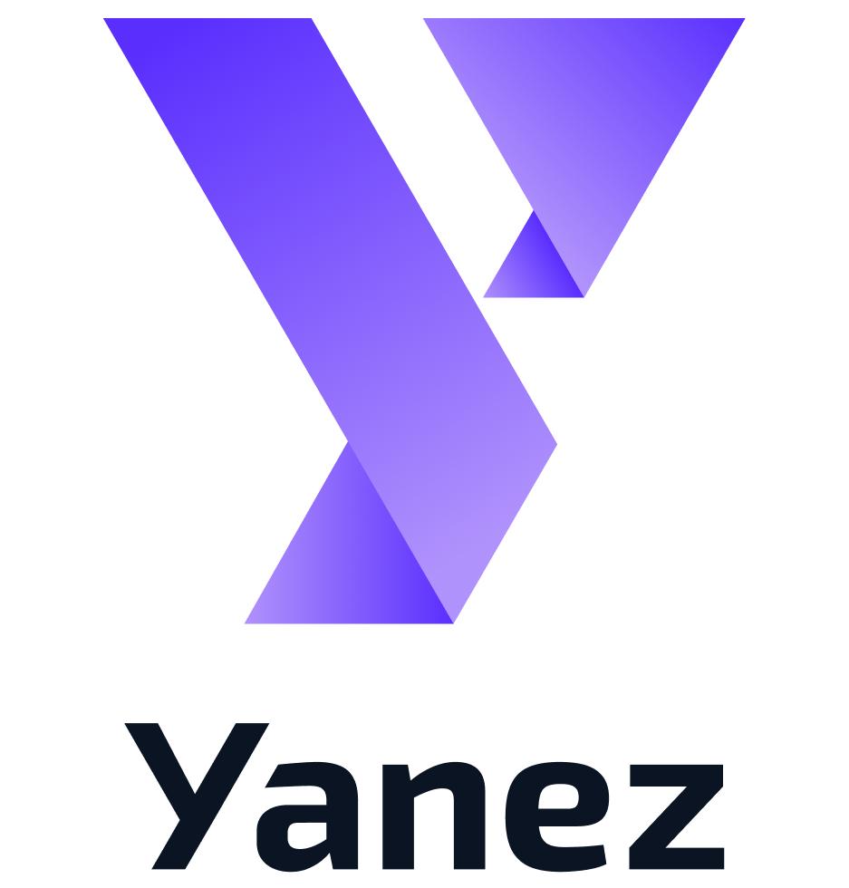

<div align="center">
<picture>
    <source srcset="YanezSubnetLogo.png" media="(prefers-color-scheme: dark)">
    <source srcset="YanezSubnetLogo.png" media="(prefers-color-scheme: light)">
    
</picture>

# **MIID Subnet 322 - Identity Testing Network**
[](https://discord.gg/bittensor)
[](https://opensource.org/licenses/MIT) 

[⛏️ Mining Guide](docs/miner.md) • [🧑‍🏫 Validator Guide](docs/validator.md) • [🚀 Quick Start](docs/README.md)
</div>

---

## 🔍 What is MIID?

**MIID** (Multimodal Inorganic Identity Dataset) is a next-generation **identity testing** and **identity data generation** subnet designed to enhance fraud detection, KYC systems, and name-matching algorithms. Our goal is to provide **financial institutions, security systems, and AI researchers** with a robust dataset of **name variations, transliterations, and identity attributes** that help identify identity fraud and evasion techniques.

By incentivizing **miners** to create high-quality identity variations, **MIID** serves as a critical tool in financial crime prevention, identity resolution, and security intelligence.

## 🎯 Why MIID Matters

Fraudsters use **identity manipulation techniques** to evade detection. **Sanctioned individuals**, **high-risk entities**, and **money launderers** exploit weaknesses in screening systems by using name variations, fake documents, and location obfuscation.

MIID **tests and enhances these systems** by:
- ✅ **Simulating Identity-Related Risk Scenarios** for AML and sanctions screening
- ✅ **Evaluating Identity Matching Algorithms**
- ✅ **Providing Identity Data for Model Training**


This network helps **governments, financial institutions, and researchers** improve their fraud detection models, making the financial ecosystem safer.

---

## ⚙️ How It Works

### 🛠️ **Miners: Generate Name Variations & Identity Attributes**
Miners process requests from validators and return **identity data variations** to enhance detection models.

- Receive identity-related tasks (e.g., name variations, transliterations, identity attribute augmentation)
- Use **LLMs** to generate valid yet challenging identity variations
- Submit responses for validation
- Earn rewards based on accuracy, diversity, and originality

### 🧑‍🏫 **Validators: Evaluate & Score Miners**
Validators ensure the dataset maintains **high-quality** and **real-world relevance**.

- Send challenge queries to miners
- Evaluate submissions based on **linguistic accuracy, realism, and relevance**
- Score miners and allocate rewards
- Update the identity dataset for use in AI models

---

## 🚀 Getting Started

### Prerequisites
- **Python 3.10+**
- **Ollama (default LLM: llama3.1)**
- **Bittensor wallet with TAO**
- **8GB+ RAM (16GB recommended)**

### 1️⃣ **Setup for Miners**
```bash
# Install dependencies
bash scripts/miner/setup.sh

# Activate the miner environment
source miner_env/bin/activate

# Start mining
python neurons/miner.py --netuid 322 --wallet.name your_wallet --wallet.hotkey your_hotkey --subtensor.network test
```

### 2️⃣ **Setup for Validators**
```bash
# Install dependencies
bash scripts/validator/setup.sh

# Activate the validator environment
source validator_env/bin/activate

# Start validating
python neurons/validator.py --netuid 322 --wallet.name your_wallet --wallet.hotkey your_hotkey --subtensor.network test
```

For detailed instructions, check our **[Mining Guide](docs/miner.md)** and **[Validator Guide](docs/validator.md)**.

---

## 🔥 Why Join MIID?

### 🔐 **Be Part of the Future of Digital Identity Security**
- Help **banks, fintech, and law enforcement agencies** strengthen fraud detection.
- Contribute to **privacy-preserving AI research**.
- Earn rewards while **enhancing AI-driven name-matching and sanctions screening**.

### 🏆 **Incentives for Participants**
- **Miners**: Earn rewards for producing high-quality, diverse identity variations.
- **Validators**: Gain influence in network security and reward distribution.

### 🌎 **Real-World Impact**
MIID is not just another AI dataset—it’s a **live, evolving system** that **challenges and improves** real-world fraud detection models. Every contribution makes financial systems **safer and more secure**.

---
## 🛣️ Roadmap

### Phase 1: Initial Launch & Name-Based Threat Scenarios (April 2025)
- Deploy MIID subnet on Bittensor mainnet.
- Enable validators to test known threat scenarios against miner responses.
- Introduce name-based execution vectors: phonetic, orthographic, and rule-based variations.

### Phase 2: Miner-Contributed Threat Scenarios (May 2025)
- Expand Threat Scenario Query System to allow miners to propose unknown threat scenarios.
- Introduce a **Post-Evaluation System** to systematically validate and assess new miner-submitted threat scenarios.
- Support new evasion tactics, including nickname-based threats, transliteration-based alterations, and middle name manipulations.
- Improve validator scoring and introduce penalties for repetitive or low-value submissions.

### Phase 3: Location-Based Threat Scenarios (July 2025)
- Add support for location obfuscation via IP, region, and geographic manipulation.
- Support organic queries to detect evasion tied to high-risk regions.

### Phase 4: AML Ecosystem Integration (September 2025)
- Open subnet to external institutions and regulators.
- Enable real-world compliance queries and expand validated execution vectors.

### Phase 5–11 (2026–2027): Identity Realism & Simulation
- Integrate biometric data (Q1 2026)
- Generate and validate synthetic documents (Q2 2026)
- Simulate digital presence and interactions (Q3 2026)
- Introduce financial transaction modeling (Q4 2026)
- Build 3D identity avatars (Q2 2027)
- Add voice and conversational AI support

### Final Phase: Unified Identity Representation
- Train a comprehensive model for identity screening.
- Launch a decentralized platform for collaborative validation and contribution.

---

## 🌍 Future Plans

We are continuously improving MIID to:
- Expand **identity data generation** for enhanced AI benchmarking.
- Integrate **more complex identity attributes** (addresses, dates of birth, etc.).
- Improve **fraud detection AI** using multi-modal data sources.

Join us in shaping the future of **identity verification and fraud prevention**.

📢 **Follow the project & contribute to our open-source development!**  
[Discord](https://discord.com/channels/799672011265015819/1351934165964296232) | [GitHub](https://github.com/yanez-compliance/MIID-subnet)

---

## 📜 License

This project is licensed under the **MIT License** - see the LICENSE file for details.

---

_Built with ❤️ by the MIID Team_
