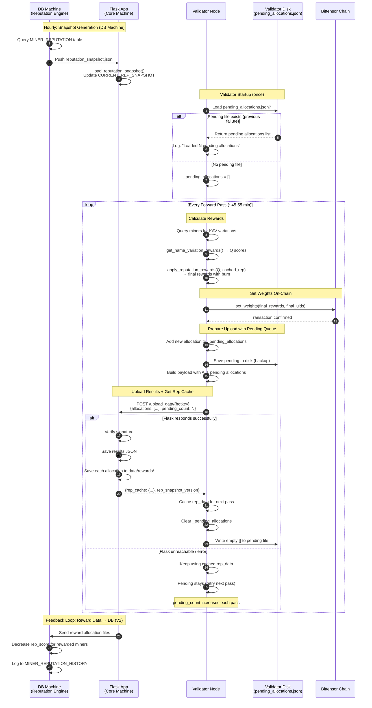

# YANEZ MIID — Reputation-Weighted Reward System (Phase 3)

This document describes the **big-picture architecture**, **data flows**, **math**, and **step-by-step implementation tasks** required to integrate the new **Reputation-Weighted Reward System** between Validators and the Flask App (Core Machine).

It includes:
- High-level system overview (full diagram logic in text)
- Reputation snapshot lifecycle
- Reward allocation lifecycle
- Math used for combining reputation with validator online quality scores
- Fully structured task list you can paste into your code agent
- API schemas and code-level expectations

---

# 1. BIG PICTURE OVERVIEW

Phase 3 of the YANEZ MIID subnet introduces **Reputation-Based Rewards**. That means:

### Validators still compute online quality scores (Phase-2 logic)
### But now they request **Reputation Scores** from the Flask API
### Validators apply multipliers based on `rep_score` and `rep_tier`
### Reputation-weighted rewards are used to compute the actual Bittensor chain weights (on-chain TAO impact)
### Validators submit final weighted rewards back to Flask every hour
### Flask stores them (JSON for now) - later inserted into DB every hour
### Reputation for each cycle is computed based on **manual validation** of UAVs

---

# 2. HIGH-LEVEL DATA FLOW

Below is the conceptual flow extracted from the system diagram.

## **A. Manual Validation -> DB -> Reputation Engine** (Happens on DB machine, not this repo)
1. Human reviewers validate UAVs.
2. Records updated in DB: `validation_score`, `comment`, `status=reviewed`.
3. Reputation Engine Job periodically:
   - Selects `validation_status='reviewed' AND rep_processed_at IS NULL`
   - Computes delta-rep per miner
   - Writes rows into `MINER_REPUTATION_HISTORY`
   - Updates `MINER_REPUTATION`
   - Marks UAVs as processed
4. A reputation snapshot is generated and placed on Flask machine.

## **B. Reputation Snapshot -> Flask -> Validators** (This repo)

### V1 Implementation (File-Based Mock):
1. `data/reputation_snapshot.json` is a file-based mock snapshot on the Flask (core) machine.
2. Generated by a local script following the actual ER diagram structure (`MINER`, `MINER_REPUTATION`).
3. Flask loads this file at startup into `CURRENT_REP_SNAPSHOT` (in-memory dict).

### Snapshot Structure:
```json
{
  "version": "2025-11-20T13:00:00Z",
  "generated_at": "2025-11-20T13:00:00Z",
  "miners": {
    "5CnkkjPdfsA...": { "rep_score": 1.23, "rep_tier": "Bronze" },
    "5DUB7kNLvvx...": { "rep_score": 1.0, "rep_tier": "Neutral" }
  }
}
```

### Validator Flow:
1. Validator uses **cached rep_data** from previous forward pass (module-level cache).
2. After `set_weights()`, validator sends results via existing `POST /upload_data/<hotkey>` (now includes `reward_allocation` field).
3. Flask returns `rep_cache` in the response (new addition to existing endpoint).
4. Validator caches the returned `rep_cache` for **next** forward pass.
5. If Flask is unreachable, validator keeps using existing cache (never falls back to Neutral).

## **C. Validator Computes Final Rewards -> Sends via Existing `/upload_data`**
1. Validator computes online quality scores Q (Phase-2 logic via `get_name_variation_rewards()` in `reward.py`).
2. Calls `apply_reputation_rewards()` which handles the entire pipeline:
   - KAV portion: 20% × Q (online quality)
   - UAV portion: 80% × R × T (reputation-based, using cached rep_data)
   - Combines KAV + UAV
   - Applies burn: rescale to `keep_fraction` + add burn UID 59
3. Uses final rewards for on-chain weight setting via `set_weights()`.
4. **Adds reward allocation data to existing `results` JSON** (already sent via `upload_data()`).
5. Flask receives JSON via existing `POST /upload_data/<hotkey>`:
   - Saves full results JSON (as it already does)
   - **Also extracts and saves reward allocation** to `data/rewards/`
   - **Returns `rep_cache`** in response for **next** cycle
6. Validator caches the returned `rep_cache` for next forward pass.
7. Cycle repeats every forward pass (~45-55 min).

> **Key Insight**: No new endpoint needed! The existing `upload_data()` flow already sends comprehensive JSON with signature verification. We just add `reward_allocation` field and modify Flask to return `rep_cache`.

---

## **D. Sequence Diagram (Complete Flow with Failure Handling)**



---

## **E. Hourly Timing Diagram**

```
Hour    :00        :15        :30        :45        :00
        |----------|----------|----------|----------|

DB Machine:
        [====Snapshot Gen====]                      [Process Rewards]
        ^                    ^                      ^
        |                    |                      |
        Query DB             Push to Flask          Read reward files
                                                    Update rep_scores

Flask App:
                   [Load]              [Collect Rewards]────────►[Send to DB]
                   ^                   ^
                   |                   |
                   Reload snapshot     Accumulate reward allocations
                                       (extracted from upload_data)

Validators (continuous):
        [--forward--][--forward--][--forward--][--forward--]
             |            |            |            |
             v            v            v            v
        set weights  set weights  set weights  set weights
        upload_data  upload_data  upload_data  upload_data
        (+ get rep↓) (+ get rep↓) (+ get rep↓) (+ get rep↓)
```

**Timeline Example (One Hour):**
```
:00:00  DB: Start generating new snapshot from MINER_REPUTATION
:00:30  DB: Snapshot complete, push to Flask server
:01:00  Flask: Detect new snapshot, reload into memory
:05:00  Validator A: forward() -> use cached rep -> set_weights -> upload_data (get rep_cache in response)
:10:00  Validator B: forward() -> use cached rep -> set_weights -> upload_data (get rep_cache in response)
:15:00  Validator A: forward() -> use cached rep -> set_weights -> upload_data (get rep_cache in response)
  ...
:55:00  Validator A: forward() -> set_weights -> upload_data (get rep_cache)
:58:00  Flask: Batch reward allocation files -> send to DB
:59:00  DB: Process rewards -> decrease rep_score for rewarded miners
:00:00  DB: Start generating new snapshot (v2) with updated scores... cycle repeats
```

---

## **F. Scheduler Behavior**

### Snapshot Generation (DB Machine - Not This Repo)
| Aspect | Behavior |
|--------|----------|
| **Frequency** | Hourly (configurable via cron) |
| **Trigger** | Cron job or manual script execution |
| **Output** | `reputation_snapshot.json` placed on Flask machine |
| **V1 Workaround** | Manual script `generate_mock_snapshot.py` creates test data |

### Flask Snapshot Loading
| Aspect | Behavior |
|--------|----------|
| **On Startup** | `load_reputation_snapshot()` called automatically |
| **Hot Reload** | Not implemented in V1 - requires Flask restart or manual call |
| **V2 Enhancement** | Add file watcher or `/reload_snapshot` admin endpoint |

### Validator Forward Loop
| Aspect | Behavior |
|--------|----------|
| **Frequency** | Every forward pass (~45-55 minutes depending on miners responses) |
| **Forward Pass** | Uses **already cached** snapshot from previous `upload_data()` response |
| **Weight Setting** | After `apply_reputation_rewards()`, using cached snapshot |
| **Upload + Rep Fetch** | Single `upload_data()` call: sends results (with `reward_allocation`), **returns `rep_cache`** |
| **Caching** | Validator caches `rep_cache` from response; if Flask unavailable, keeps using existing cache |

### Reward Allocation Storage (Flask)
| Aspect | Behavior |
|--------|----------|
| **Source** | Extracted from `reward_allocation` field in `/upload_data` request |
| **Storage Path** | `data/rewards/<cycle_id>/<validator_hotkey>/reward_<timestamp>.<hex>.json` |
| **Retention** | Until sent to DB (then archived or deleted) |
| **V2 Enhancement** | Flask batches and sends to DB hourly |

### Flask → DB Feedback Loop (Reward Data)
| Aspect | Behavior |
|--------|----------|
| **Purpose** | DB needs to know which miners received rewards to update their rep_score |
| **Trigger** | Hourly batch (before next snapshot generation) |
| **Data Sent** | Reward allocation files with miner hotkeys and reward amounts |
| **DB Action** | Decrease `rep_score` for miners who received rewards (`got_rewarded` event) |
| **V1 Workaround** | Manual transfer or dummy/empty (no actual DB update) |
| **V2 Enhancement** | Automated pipeline: Flask → DB ingestion → rep_score update |

### V1 vs V2 Scheduler Comparison

| Component | V1 (Current) | V2 (Future) |
|-----------|--------------|-------------|
| Snapshot Source | Manual JSON file | DB query + auto-push |
| Flask Reload | On startup only | File watcher / API trigger |
| Rep Cache Delivery | Returned in `/upload_data` response | Same (could add dedicated endpoint) |
| Reward Processing | Extracted from `/upload_data`, saved locally | JSON → DB ingestion pipeline |
| Flask → DB Feedback | Not implemented (dummy) | Automated hourly batch |
| Rep Score Decay | Not implemented | `got_rewarded` entries decrease rep_score |

---

# 3. MATH: REPUTATION-WEIGHTED REWARD FORMULA (Cycle 2)

Phase 3 Cycle 2 introduces a **reputation-weighted reward system** that separates emissions into two components:
- **KAV (Known Attack Vector)**: Online quality from validator evaluation
- **UAV (Unknown Attack Vector)**: Reputation-based rewards from manual validation

## Allocation Weights

```python
KAV_WEIGHT = 0.20      # 20% allocated to online quality (Q)
UAV_WEIGHT = 0.80      # 80% allocated to reputation-based rewards
# BURN_FRACTION uses existing config: self.config.neuron.burn_fraction (default: 0.40, set to 0.75 for Cycle 2)
```

> **Note**: `burn_fraction` is an existing config parameter (`--neuron.burn_fraction`). For Cycle 2, set it to `0.75` when running the validator.

## Variables

| Variable | Description | Source |
|----------|-------------|--------|
| `Q` | Online Quality Score | `get_name_variation_rewards()` in validator |
| `R` | Reputation Score | Flask API (computed by DB: novelty × impact × quality × reputation × penalty) |
| `T` | Tier Multiplier | Flask API (based on rep_tier) |

## Tier Multipliers

```python
TIER_MULTIPLIERS = {
    "Diamond": 1.15,
    "Gold":    1.10,
    "Silver":  1.05,
    "Bronze":  1.02,
    "Neutral": 1.00,
    "Watch":   0.90,
}
```

## Tier Boundaries (from reputation-policy-v1.md)

> **NOTE**: Tier assignment is done by the database Reputation Engine, not by the validator.
> The validator receives `rep_tier` from Flask and uses it for multiplier lookup and normalization.
> **Watch tier**: Assigned when rep_score calculation goes negative, but stored value is clamped to 0.1 floor.

| Tier | rep_score Range |
|------|-----------------|
| **Diamond** | ≥ 50.0 |
| **Gold** | 30.0 – 49.999 |
| **Silver** | 15.0 – 29.999 |
| **Bronze** | >5.0 – 14.999 |
| **Neutral** | 0.1 – 5.0 (baseline miners) |
| **Watch** | < 0.1 (penalized miners, clamped to 0.1) |

## rep_score Normalization (Critical)

### Why Normalization is Required

The `rep_score` from the policy ranges from **0.10 to 9999.0** (cumulative trust metric). Using raw rep_score directly in the reward formula would create **extreme disparity**:

```
Without normalization:
- Diamond miner (rep_score=50.0): UAV = 0.80 × 50.0 × 1.15 = 46.0
- Neutral miner (rep_score=1.0):  UAV = 0.80 × 1.0  × 1.00 = 0.80
- Ratio: 57.5x more reward for Diamond!
```

This is problematic because:
1. **Diamond miners would dominate emissions** - a single Diamond miner could capture most rewards
2. **New miners have no chance** - baseline 1.0 vs 50.0+ creates insurmountable gap
3. **Undermines KAV incentive** - 20% KAV becomes meaningless when UAV varies 50x+

### Solution: Linear Clamp Normalization

We normalize `rep_score` to a **reward-friendly range (0.5 – 2.0)** before using it in the formula. This:
- Preserves tier ordering (Diamond > Gold > Silver > Bronze > Neutral > Watch)
- Keeps reward ratios reasonable (max ~2.5x between tiers)
- Makes both KAV and UAV meaningful contributors

```python
# Normalization uses CONTINUOUS function based on actual rep_score
# NO tier-based clamping - as rep_score decays, normalized value decreases
# Score ranges and their normalized output:
#   0.0  - 0.1   → 0.00 - 0.50  (decayed/Watch)
#   0.1  - 5.0   → 0.50 - 1.00  (Neutral)
#   5.0  - 15.0  → 1.00 - 1.20  (Bronze)
#   15.0 - 30.0  → 1.20 - 1.50  (Silver)
#   30.0 - 50.0  → 1.50 - 1.80  (Gold)
#   50.0+        → 1.80 - 2.00  (Diamond)

def normalize_rep_score(rep_score: float, rep_tier: Optional[str] = None) -> float:
    """
    Normalize rep_score to reward-friendly range (0.0 - 2.0).

    Uses actual rep_score value - NO tier-based clamping.
    As rep_score decays, normalized value decreases proportionally.
    When rep_score = 0, normalized = 0 (zero UAV).

    Args:
        rep_score: Raw reputation score from DB (can decay to 0)
        rep_tier: Unused (kept for API compatibility)

    Returns:
        Normalized rep_score: 0.0 when score=0, up to 2.0 for high scores
    """
    if rep_score <= 0:
        return 0.0

    if rep_score < 0.1:
        return rep_score * (0.50 / 0.1)
    elif rep_score <= 5.0:
        return 0.50 + (rep_score - 0.1) * (1.00 - 0.50) / (5.0 - 0.1)
    elif rep_score <= 15.0:
        return 1.00 + (rep_score - 5.0) * (1.20 - 1.00) / (15.0 - 5.0)
    elif rep_score <= 30.0:
        return 1.20 + (rep_score - 15.0) * (1.50 - 1.20) / (30.0 - 15.0)
    elif rep_score <= 50.0:
        return 1.50 + (rep_score - 30.0) * (1.80 - 1.50) / (50.0 - 30.0)
    else:
        return min(2.00, 1.80 + (rep_score - 50.0) * (2.00 - 1.80) / (9999.0 - 50.0))
```

### Normalization Results (Active Miners)

| Tier | rep_score | Normalized R | Tier Mult (T) | UAV Reward |
|------|-----------|--------------|---------------|------------|
| Diamond | 75.0 | 1.80 | 1.15 | 0.80 × 1.80 × 1.15 = **1.66** |
| Gold | 40.0 | 1.65 | 1.10 | 0.80 × 1.65 × 1.10 = **1.45** |
| Silver | 22.0 | 1.34 | 1.05 | 0.80 × 1.34 × 1.05 = **1.13** |
| Bronze | 10.0 | 1.10 | 1.02 | 0.80 × 1.10 × 1.02 = **0.90** |
| Neutral | 3.0 | 0.80 | 1.00 | 0.80 × 0.80 × 1.00 = **0.64** |
| Watch | 0.05 | 0.25 | 0.90 | 0.80 × 0.25 × 0.90 = **0.18** |
| Decayed | 0.0 | 0.00 | 0.00 | 0.80 × 0.00 × 0.00 = **0.00** |

### Decay Example (Gold Miner Over Time)

| Stage | rep_score | Normalized R | UAV Reward |
|-------|-----------|--------------|------------|
| Initial | 40.0 | 1.65 | 1.45 |
| Decayed to Silver range | 20.0 | 1.30 | 0.80 × 1.30 × 1.10 = 1.14 |
| Decayed to Bronze range | 10.0 | 1.10 | 0.80 × 1.10 × 1.10 = 0.97 |
| Decayed to Neutral range | 3.0 | 0.80 | 0.80 × 0.80 × 1.10 = 0.70 |
| Decayed to Watch range | 0.05 | 0.25 | 0.80 × 0.25 × 1.10 = 0.22 |
| Decayed to zero | 0.0 | 0.00 | **0.00** (KAV only) |

**Key insight**: Tier label stays "Gold" but rewards decrease based on actual rep_score.

> **Watch tier**: Miners who accumulated negative rep_score through penalties. Their score is clamped to 0.1 but they receive the lowest normalized value (0.50) plus Watch multiplier (0.90).

This keeps reputation meaningful while preventing runaway dominance.

## Formula Steps

### **Step 1 — Calculate KAV Portion (Online Quality)**
```python
kav_reward = KAV_WEIGHT * Q
# Example: 0.20 * 0.85 = 0.17
```

### **Step 2 — Calculate UAV Portion (Reputation-Based)**
The `rep_score` from Flask is a cumulative trust metric (0.10 - 9999.0).
We **normalize** it to a reward-friendly range (0.5 - 2.0) before applying tier multiplier:

```python
# Normalize rep_score to prevent extreme disparity
R_norm = normalize_rep_score(rep_score, rep_tier)

# Apply tier multiplier for additional weighting
T = TIER_MULTIPLIERS.get(rep_tier, 1.0)
uav_reward = UAV_WEIGHT * R_norm * T
# Example: 0.80 * 1.65 * 1.10 = 1.45 (Gold tier, rep_score=25.0, normalized=1.65)
```

### **Step 3 — Combine KAV + UAV**
```python
combined_reward = kav_reward + uav_reward
# Example: 0.17 + 1.056 = 1.226
# This is the miner's reputation-weighted reward (used for weight calculation)
```

### **Step 4 — Burn Applied ONCE in apply_reputation_rewards()**
> **Important**: Burn is applied **only once** after KAV + UAV are combined. The `get_name_variation_rewards()` function is called with `skip_burn=True` to return raw quality scores, then `apply_reputation_rewards()` applies burn after combining KAV + UAV:

```python
# Burn is applied in apply_reputation_rewards() AFTER combining KAV + UAV:
total_reward_sum = np.sum(combined_rewards)  # Sum of all KAV+UAV rewards
keep_fraction = 1.0 - burn_fraction  # e.g., 0.25 if burn=0.75

# Rescale ALL miners proportionally
rescale_factor = keep_fraction / total_reward_sum
final_rewards = combined_rewards * rescale_factor

# Add burn UID 59 with burn_fraction weight
final_rewards = np.append(final_rewards, burn_fraction)
final_uids = np.append(uids, BURN_UID)  # e.g., 0.75 goes to burn
```

This means:
- `get_name_variation_rewards(skip_burn=True)` returns raw KAV quality scores (no burn)
- `apply_reputation_rewards()` combines KAV + UAV, then applies burn ONCE
- Miners collectively receive `keep_fraction` (e.g., 25%) of emissions
- Burn UID 59 receives `burn_fraction` (e.g., 75%) of emissions
- Each miner's **relative share** is preserved based on their `combined_reward`

### **Step 5 — Metrics for Logging**
```python
kav_contribution = kav_reward / combined_reward  # % from online quality
uav_contribution = uav_reward / combined_reward  # % from reputation
```

## Complete Formula (Summary)

```python
def calculate_reputation_reward(Q, rep_score, rep_tier):
    """
    Calculate the reputation-weighted reward for a single miner.

    Args:
        Q: Online quality score from get_name_variation_rewards()
        rep_score: Raw reputation score from Flask (0.10 - 9999.0)
        rep_tier: Tier string from Flask (Diamond/Gold/Silver/Bronze/Neutral/Watch)

    Returns:
        The combined_reward value to be used in weight calculation.
        Burn is applied later by the existing mechanism (proportional rescaling).
    """
    KAV_WEIGHT = 0.20
    UAV_WEIGHT = 0.80

    # Normalize rep_score to reward-friendly range (0.5 - 2.0)
    # This prevents Diamond miners (rep_score=50+) from dominating emissions
    R_norm = normalize_rep_score(rep_score, rep_tier)

    # Tier multiplier (additional weighting on top of normalized score)
    T = TIER_MULTIPLIERS.get(rep_tier, 1.0)

    # KAV portion (online quality)
    kav_reward = KAV_WEIGHT * Q

    # UAV portion (reputation-based, using NORMALIZED rep_score)
    uav_reward = UAV_WEIGHT * R_norm * T

    # Combine KAV + UAV (burn applied later by existing mechanism)
    combined_reward = kav_reward + uav_reward

    return {
        "kav_reward": kav_reward,
        "uav_reward": uav_reward,
        "combined_reward": combined_reward,  # This is used for weight calculation
        "rep_score_normalized": R_norm,
        "tier_multiplier": T
    }
```

## Example Calculations

| Miner | Q | Raw rep_score | Tier | R_norm | T | KAV (20%) | UAV (80%) | Combined |
|-------|---|---------------|------|--------|---|-----------|-----------|----------|
| A | 0.90 | 55.0 | Diamond | 1.80 | 1.15 | 0.18 | 1.66 | **1.84** |
| B | 0.85 | 3.0 | Neutral | 0.80 | 1.00 | 0.17 | 0.64 | **0.81** |
| C | 0.70 | 10.0 | Bronze | 1.10 | 1.02 | 0.14 | 0.90 | **1.04** |
| D | 0.95 | 0.1 (neg→clamped) | Watch | 0.50 | 0.90 | 0.19 | 0.36 | **0.55** |
| E | 0.80 | — | **New** | 0.00 | 0.00 | 0.16 | 0.00 | **0.16** |
| **Total** | | | | | | | | **4.40** |

> **Note**: R_norm = `normalize_rep_score(raw_rep_score, tier)`. Tier is assigned by database based on reputation-policy-v1.md boundaries.
> **New miners** (not in rep_data) get **zero UAV** - only KAV rewards until they build reputation.
> **Watch miners** went negative through penalties - score clamped to 0.1, lowest normalized value.

**Burn Applied (75% burn, 25% keep):**
```
Total combined = 4.40
keep_fraction = 0.25
rescale_factor = 0.25 / 4.40 = 0.0568

Final weights:
- Miner A (Diamond): 1.84 * 0.0568 = 0.104 (10.4% of emissions)
- Miner B (Neutral): 0.81 * 0.0568 = 0.046 (4.6% of emissions)
- Miner C (Bronze):  1.04 * 0.0568 = 0.059 (5.9% of emissions)
- Miner D (Watch):   0.55 * 0.0568 = 0.031 (3.1% of emissions) ← Penalized!
- Miner E (New):     0.16 * 0.0568 = 0.009 (0.9% of emissions) ← KAV only!
- Burn UID 59: 0.75 (75% of emissions)
- Sum: ~1.0
```

**Key Insights**:
1. **Normalization prevents runaway dominance** - Diamond miner A gets ~3x more than Watch miner D (not 50x+)
2. **KAV still matters** - Miner D has excellent online quality (0.95) but Watch penalty tanks their reward
3. **Tier progression is meaningful** - Each tier step up provides noticeable but fair advantage
4. **Incentivizes long-term behavior** - Building reputation from Watch→Diamond takes sustained good UAVs
5. **New miners must earn reputation** - Miner E only gets KAV (0.9% vs Diamond's 10.4%) until they contribute validated UAVs
6. **Watch tier penalizes bad actors** - Miners who accumulated negative scores get lowest rewards (3.1%)

---

# 4. API SCHEMAS

## **4.1 `POST /upload_data/<hotkey>` (EXISTING - ENHANCED)**

> **Design**: Use existing endpoint. Add `reward_allocation` field to request, add `rep_cache` to response. No new endpoint needed.

**Request (Enhanced with `reward_allocation` field):**
```json
{
  "timestamp": "2025-11-20_14-00-00",
  "seed_names_with_labels": [...],
  "query_template": "...",
  "responses": {...},
  "rewards": {...},
  "Weights": {...},
  "metagraph_scores": {...},
  "signature": "<Bytes>...</Bytes>\n\tSigned by: ...\n\tSignature: ...",

  "reward_allocation": {
    "rep_snapshot_version": "2025-11-20T13:00:00Z",
    "cycle_id": "cycle_2025-11-20_14-00-00",
    "pending_count": 2,
    "allocations": [
      {
        "timestamp": "2025-11-20T13:00:00Z",
        "rep_snapshot_version": "2025-11-20T12:00:00Z",
        "miners": [
          {
            "miner_hotkey": "5CnkkjPdfsA...",
            "uid": 42,
            "quality_score": 0.85,
            "rep_score": 1.23,
            "rep_score_normalized": 1.05,
            "rep_tier": "Bronze",
            "kav_reward": 0.17,
            "uav_reward": 0.86,
            "combined_reward": 1.03,
            "tier_multiplier": 1.02,
            "final_reward": 0.065
          }
        ]
      },
      {
        "timestamp": "2025-11-20T14:00:00Z",
        "rep_snapshot_version": "2025-11-20T13:00:00Z",
        "miners": [...]
      }
    ]
  }
}
```

**Response (Enhanced with `rep_cache`):**
```json
{
  "message": "Data received and verified successfully",
  "filename": "5DUB7kNLvvx....2025-11-20_14-00-00.a1b2c3d4.json",

  "rep_snapshot_version": "2025-11-20T14:00:00Z",
  "generated_at": "2025-11-20T14:00:00Z",
  "rep_cache": {
    "5CnkkjPdfsA...": {"rep_score": 1.23, "rep_tier": "Bronze"},
    "5DUB7kNLvvx...": {"rep_score": 1.0, "rep_tier": "Neutral"},
    "5GWzXSra6cB...": {"rep_score": 1.15, "rep_tier": "Gold"}
  }
}
```

**Response includes:**
1. `message` + `filename`: Existing confirmation (unchanged)
2. `rep_snapshot_version` + `rep_cache`: **NEW** - ALL miners in snapshot for **next** forward pass

**Error Responses (unchanged):**
- `400`: Missing signature or invalid JSON
- `403`: Unauthorized hotkey

---

# 5. FAILURE HANDLING

## Flask Unavailable
- Validators **keep using the last known rep_cache** from previous successful `upload_data()` response.
- Validators **do not fall back to Neutral** - this would unfairly penalize miners.
- Validators cache `rep_cache` locally with `rep_snapshot_version`.
- Results JSON is preserved locally (existing behavior) and can be retried manually.

### Problem: Missed Allocations
If Flask is unreachable, miners still get rewarded on-chain but the DB never knows → their `rep_score` won't be decreased. This creates unfair advantage.

### Solution: Automatic Pending Queue with Retry
Validator maintains a **pending allocations queue** that automatically accumulates unsent allocations and sends ALL pending when Flask becomes available:

```python
# Module-level (persisted to disk for restart recovery)
_pending_allocations = []  # List of allocations not yet confirmed by Flask

# File: validator_results/pending_allocations.json
[
  {"timestamp": "2025-11-20T14:00:00Z", "miners": [...]},  # Flask was down
  {"timestamp": "2025-11-20T15:00:00Z", "miners": [...]}   # Flask was down
]
```

**How it works:**
1. After `apply_reputation_rewards()`, add new allocation to `_pending_allocations`
2. Save pending list to disk (survives validator restart)
3. When building `reward_allocation` payload, include **ALL pending allocations**
4. On successful `upload_data()` response → clear pending list + delete file
5. On failure → pending list stays, will retry on next forward pass

**Benefits:**
1. **Fully automatic**: No manual intervention needed
2. **Accumulates missed**: All unsent allocations are tracked
3. **Batch retry**: Sends all pending in one request when Flask is back
4. **Restart-safe**: Pending list persisted to disk

**Implementation** (add to Task 6):

### Step 6.6: Add pending allocations queue (module-level)
```python
import json
from pathlib import Path

# Module-level pending queue (persists across forward passes)
_pending_allocations = []
_pending_file_path = None  # Set in forward() based on config

def _load_pending_allocations(file_path: Path) -> list:
    """Load pending allocations from disk on startup."""
    if file_path.exists():
        try:
            with open(file_path, 'r') as f:
                return json.load(f)
        except:
            return []
    return []

def _save_pending_allocations(file_path: Path, pending: list):
    """Save pending allocations to disk."""
    file_path.parent.mkdir(parents=True, exist_ok=True)
    with open(file_path, 'w') as f:
        json.dump(pending, f, indent=2)

def _clear_pending_allocations(file_path: Path):
    """Clear pending after successful send (overwrite with empty array, no delete needed)."""
    _save_pending_allocations(file_path, [])  # Overwrite with empty array
```

### Step 6.7: Integrate pending queue into forward() flow
```python
# --- PENDING ALLOCATIONS HANDLING ---
global _pending_allocations, _pending_file_path

# Initialize pending file path (once)
if _pending_file_path is None:
    _pending_file_path = Path(self.config.logging.logging_dir) / "validator_results" / "pending_allocations.json"
    _pending_allocations = _load_pending_allocations(_pending_file_path)
    if _pending_allocations:
        bt.logging.info(f"Loaded {len(_pending_allocations)} pending allocations from previous session")

# After apply_reputation_rewards(), add new allocation to pending
new_allocation = {
    "timestamp": timestamp,
    "rep_snapshot_version": _cached_rep_version,
    "miners": combined_metrics
}
_pending_allocations.append(new_allocation)
_save_pending_allocations(_pending_file_path, _pending_allocations)

# Build reward_allocation with ALL pending (not just current)
results["reward_allocation"] = {
    "rep_snapshot_version": _cached_rep_version,
    "cycle_id": f"cycle_{timestamp}",
    "pending_count": len(_pending_allocations),
    "allocations": _pending_allocations  # ALL pending allocations
}

# ... upload_data() call ...

# On SUCCESS: clear all pending (they were all sent)
if upload_response and upload_response.get("rep_cache"):
    _pending_allocations = []
    _clear_pending_allocations(_pending_file_path)
    bt.logging.info(f"Cleared pending allocations after successful upload")
# On FAILURE: pending stays, will retry next forward pass
else:
    bt.logging.warning(f"Upload failed. {len(_pending_allocations)} allocations pending for retry")
# --- END PENDING ALLOCATIONS HANDLING ---
```

**Flask side change** (Task 3): Flask should handle `allocations` array (multiple allocations in one request) and save each one separately to `data/rewards/`.

## Snapshot File Missing at Startup
- Flask logs a warning but continues running.
- `/upload_data/<hotkey>` returns empty `rep_cache: {}` (validators use cached or default to Neutral).
- Once snapshot file is created/updated, Flask can reload it (requires restart in V1).

## New Miners (Not in Snapshot)
- New miners (not in `rep_data`) receive **zero UAV rewards** - they only get KAV (online quality) rewards
- They must first contribute validated UAVs to build reputation before receiving UAV-based rewards
- In metrics: `is_new_miner: true`, `rep_tier: "New"`, `rep_score: 0`, `uav_portion: 0`
- This incentivizes new miners to contribute quality UAVs to earn reputation

## Decayed Miners (rep_score = 0)
- **Decay mechanism**: 0.01 is subtracted from rep_score each time a miner receives rewards
- If a miner's rep_score decays to 0 (or below), they receive **zero UAV rewards**
- **Tier stays as-is** - a Diamond miner with rep_score = 0 is still labeled "Diamond" in the DB
- They only receive KAV portion based on their online quality score
- To earn UAV rewards again, they must contribute new validated UAVs to increase their rep_score
- This prevents "coasting" - miners must actively contribute, not just stay online

## Decay Dynamics: Bronze Can Outperform Diamond

The decay mechanism means **tier labels don't guarantee higher rewards**. A freshly promoted Bronze miner can earn more than a decayed Diamond miner.

### Example Scenario

**Miner A (Diamond, decayed):**
- Tier label: Diamond (earned long ago)
- Current rep_score: 2.0 (heavily decayed from 55.0)
- Has been collecting rewards without contributing new UAVs

**Miner B (Bronze, fresh):**
- Tier label: Bronze (just promoted)
- Current rep_score: 12.0 (actively contributing)
- Recently validated UAVs boosted their score

### Reward Calculation

| Miner | Tier | rep_score | R_norm | T | UAV Portion |
|-------|------|-----------|--------|---|-------------|
| A (Diamond, decayed) | Diamond | 2.0 | 0.69 | 1.15 | 0.80 × 0.69 × 1.15 = **0.63** |
| B (Bronze, fresh) | Bronze | 12.0 | 1.14 | 1.02 | 0.80 × 1.14 × 1.02 = **0.93** |

**Result: Bronze miner B earns 47% more UAV rewards than Diamond miner A!**

### More Extreme Example

| Miner | Tier | rep_score | R_norm | T | UAV Portion |
|-------|------|-----------|--------|---|-------------|
| Diamond (almost zero) | Diamond | 0.5 | 0.54 | 1.15 | 0.80 × 0.54 × 1.15 = **0.50** |
| Watch (at floor) | Watch | 0.1 | 0.50 | 0.90 | 0.80 × 0.50 × 0.90 = **0.36** |
| Bronze (active) | Bronze | 14.0 | 1.18 | 1.02 | 0.80 × 1.18 × 1.02 = **0.96** |
| Neutral (active) | Neutral | 5.0 | 1.00 | 1.00 | 0.80 × 1.00 × 1.00 = **0.80** |

**Key insight**:
- An **active Neutral miner** (rep_score=5.0) earns **more** than a **decayed Diamond** (rep_score=0.5)
- Tier labels are historical achievements; **actual rep_score determines current rewards**
- This incentivizes continuous contribution, not coasting on past performance

---

# 6. IMPLEMENTATION TASKS

## Overview of Files to Modify/Create

> **Note**: There are TWO config files - Flask config (runs on Flask server) and Validator config (runs on validator machine). They cannot share imports.

| File | Action |
|------|--------|
| `MIID/datasets/config.py` | **Flask config** - Add reputation paths, tier multipliers (Flask server) |
| `MIID/utils/config.py` | **Validator config** - Add `--neuron.kav_weight`, `--neuron.uav_weight` args |
| `MIID/datasets/app.py` | **Modify existing** `/upload_data/<hotkey>` endpoint (extract reward_allocation, return rep_cache) |
| `MIID/validator/reward.py` | Add `apply_reputation_rewards()` function; add `skip_burn` parameter to `get_name_variation_rewards()` |
| `MIID/utils/misc.py` | **Modify existing** `upload_data()` to return response (for rep_cache extraction) |
| `MIID/validator/forward.py` | Add `reward_allocation` to existing results JSON; cache rep_cache from response |
| `scripts/generate_mock_snapshot.py` | New script to generate test snapshots |
| `data/reputation_snapshot.json` | Mock snapshot file (on Flask server) |

## Function Architecture

```
┌─────────────────────────────────────────────────────────────────┐
│                        forward.py                                │
│                                                                  │
│  1. Call get_name_variation_rewards()  ──► KAV rewards (Q)      │
│  2. Use CACHED rep_data from previous forward pass              │
│  3. Call apply_reputation_rewards()    ──► Final rewards + burn │
│  4. set_weights() on chain                                      │
│  5. Add reward_allocation to existing results JSON              │
│  6. upload_data() (EXISTING)           ──► Send results JSON    │
│                                            (now returns response)│
│  7. Cache rep_cache from response for NEXT cycle                │
│                                                                  │
│  (Uses EXISTING Flask endpoint: /upload_data/<hotkey>)          │
└─────────────────────────────────────────────────────────────────┘

┌─────────────────────────────────────────────────────────────────┐
│                        reward.py                                 │
│                                                                  │
│  get_name_variation_rewards()   [EXISTING - ADD skip_burn PARAM]│
│     └─► Returns KAV quality scores (Q) for each miner           │
│     └─► Call with skip_burn=True to return raw scores (no burn) │
│                                                                  │
│  apply_reputation_rewards()     [NEW - SINGLE FUNCTION]         │
│     └─► Takes KAV rewards + rep_data                            │
│     └─► Calculates UAV: R × T for each miner                    │
│     └─► Combines: (0.20 × Q) + (0.80 × R × T)                   │
│     └─► Applies burn ONCE: rescale to keep_fraction + burn UID  │
│     └─► Returns final rewards ready for set_weights()           │
└─────────────────────────────────────────────────────────────────┘
```

---

## **TASK 1 — Add Configuration for Reputation System**

**File:** `MIID/datasets/config.py`

Add:
```python
# Reputation system configuration
REPUTATION_SNAPSHOT_PATH = "/data/MIID_data/reputation_snapshot.json"
REWARDS_DIR = "/data/MIID_data/rewards"

# Reputation-weighted reward allocation (Cycle 2)
KAV_WEIGHT = 0.20      # 20% allocated to online quality (Q)
UAV_WEIGHT = 0.80      # 80% allocated to reputation-based rewards
# Note: burn_fraction already exists as --neuron.burn_fraction (default 0.40)
# For Cycle 2, run validator with: --neuron.burn_fraction 0.75

# Tier multipliers for reputation weighting
TIER_MULTIPLIERS = {
    "Diamond": 1.15,
    "Gold":    1.10,
    "Silver":  1.05,
    "Bronze":  1.02,
    "Neutral": 1.00,
    "Watch":   0.90,
}
```

---

## **TASK 2 — Create Reputation Snapshot Loader and In-Memory Cache**

**File:** `MIID/datasets/app.py`

Add at top (after imports):
```python
import threading

# Global reputation snapshot cache
CURRENT_REP_SNAPSHOT = {
    "version": None,
    "generated_at": None,
    "miners": {}
}
_snapshot_lock = threading.Lock()


def load_reputation_snapshot():
    """Load reputation snapshot from JSON file into memory."""
    global CURRENT_REP_SNAPSHOT

    snapshot_path = REPUTATION_SNAPSHOT_PATH
    if not os.path.exists(snapshot_path):
        bt.logging.warning(f"Reputation snapshot not found at {snapshot_path}. Using empty snapshot.")
        return

    try:
        with open(snapshot_path, 'r', encoding='utf-8') as f:
            data = json.load(f)

        with _snapshot_lock:
            CURRENT_REP_SNAPSHOT = {
                "version": data.get("version"),
                "generated_at": data.get("generated_at"),
                "miners": data.get("miners", {})
            }
        bt.logging.info(f"Loaded reputation snapshot version: {CURRENT_REP_SNAPSHOT['version']} with {len(CURRENT_REP_SNAPSHOT['miners'])} miners")
    except Exception as e:
        bt.logging.error(f"Failed to load reputation snapshot: {e}")


# Load snapshot on module import (Flask startup)
load_reputation_snapshot()
```

---

## **TASK 3 — Modify Existing `/upload_data/<hotkey>` Endpoint**

**File:** `MIID/datasets/app.py`

> **Design**: Enhance the EXISTING endpoint to:
> 1. Extract `reward_allocation` field from the results JSON (if present)
> 2. Save reward allocation separately to `data/rewards/`
> 3. Return `rep_cache` in the response for next forward pass
>
> **No new endpoint needed!**

Modify the existing `upload_data` function:
```python
@app.route('/upload_data/<hotkey>', methods=['POST'])
def upload_data(hotkey):
    # ... existing validation and signature verification (unchanged) ...

    # After saving the main results JSON (existing code around line 76):
    # with open(filepath, 'w', encoding='utf-8') as f:
    #     json.dump(data, f, indent=2)

    # --- NEW: Extract and save reward_allocation if present ---
    reward_allocation = data.get("reward_allocation")
    if reward_allocation:
        cycle_id = reward_allocation.get("cycle_id", "unknown")

        # Handle allocations array (may contain multiple pending allocations)
        allocations = reward_allocation.get("allocations", [])

        # If no allocations array, check for legacy "miners" field (backwards compatibility)
        if not allocations and reward_allocation.get("miners"):
            allocations = [{
                "timestamp": reward_allocation.get("rep_snapshot_version"),
                "rep_snapshot_version": reward_allocation.get("rep_snapshot_version"),
                "miners": reward_allocation.get("miners")
            }]

        # Save each allocation separately
        saved_count = 0
        for allocation in allocations:
            alloc_timestamp = allocation.get("timestamp", "unknown")

            # Save to data/rewards/<cycle_id>/<hotkey>/
            rewards_dir = os.path.join(REWARDS_DIR, cycle_id, hotkey)
            os.makedirs(rewards_dir, exist_ok=True)

            reward_timestamp = datetime.now().strftime("%Y-%m-%d_%H-%M-%S")
            reward_hex = secrets.token_hex(4)
            reward_filename = f"reward_{reward_timestamp}.{reward_hex}.json"
            reward_filepath = os.path.join(rewards_dir, reward_filename)

            with open(reward_filepath, 'w', encoding='utf-8') as f:
                json.dump(allocation, f, indent=2)

            saved_count += 1

        bt.logging.info(f"Saved {saved_count} reward allocation(s) to {rewards_dir}")
    # --- END NEW ---

    # --- NEW: Get rep_cache for response ---
    with _snapshot_lock:
        snapshot_version = CURRENT_REP_SNAPSHOT.get("version")
        generated_at = CURRENT_REP_SNAPSHOT.get("generated_at")
        rep_cache = CURRENT_REP_SNAPSHOT.get("miners", {})

    # --- MODIFY: Enhance response with rep_cache ---
    return jsonify({
        "message": "Data received and verified successfully",
        "filename": final_filename,
        # NEW fields for reputation system:
        "rep_snapshot_version": snapshot_version,
        "generated_at": generated_at,
        "rep_cache": rep_cache  # All miners: {hotkey: {rep_score, rep_tier}, ...}
    }), 200
```

**Key Changes to Existing Endpoint:**
1. Add import: `from MIID.datasets.config import REWARDS_DIR` (after adding to config)
2. After saving main JSON, check for `reward_allocation` field and save separately
3. Add `rep_cache` to response (ALL miners in snapshot)

---

## **TASK 4 — Add apply_reputation_rewards() Function and Modify get_name_variation_rewards()**

**File:** `MIID/validator/reward.py`

> **Key Design**:
> 1. Add `skip_burn: bool = False` parameter to `get_name_variation_rewards()` so it can return raw quality scores when `skip_burn=True`
> 2. Add ONE new function `apply_reputation_rewards()` that handles UAV + combine + burn ONCE
>
> **CRITICAL**: Burn must be applied ONCE after KAV + UAV are combined. Call `get_name_variation_rewards(skip_burn=True)` to get raw scores, then `apply_reputation_rewards()` applies burn.

### 4.1 Modify get_name_variation_rewards() to add skip_burn parameter

Add `skip_burn: bool = False` parameter to the function signature and add early return when `skip_burn=True`:

```python
def get_name_variation_rewards(
    # ... existing parameters ...
    skip_burn: bool = False  # Phase 3: Skip burn when using reputation-weighted rewards
) -> Tuple[np.ndarray, np.ndarray, List[Dict]]:
    """
    ... existing docstring ...

    Args:
        skip_burn: If True, return raw rewards without applying burn.
                   Use this when calling from reputation-weighted reward flow,
                   where burn is applied ONCE in apply_reputation_rewards().
    """
    # ... existing calculation logic that produces rewards, uids, detailed_metrics ...

    # At the end, BEFORE the existing burn logic, add:
    if skip_burn:
        bt.logging.info("Skipping burn application (will be applied after reputation weighting)")
        return rewards, np.array(uids), detailed_metrics

    # ... existing burn logic continues for non-reputation-weighted flow ...
```

### 4.2 Constants and Configuration

> **Note**: There are TWO config files that run on DIFFERENT machines:
> - `MIID/datasets/config.py` - Flask server config (cannot be imported by validator)
> - `MIID/utils/config.py` - Validator config (argparse + `getattr()` pattern)
>
> **Approach**: Policy-based constants (rarely change) are defined locally in `reward.py`. Configurable weights use `getattr()` from validator config.

**In `MIID/utils/config.py` (validator config):**
```python
# --- Reputation-Weighted Reward Configuration (Phase 3 - Cycle 2) ---
parser.add_argument(
    '--neuron.kav_weight',
    type=float,
    help="Weight for KAV (online quality) in reputation-weighted rewards (default: 0.20 = 20%).",
    default=0.20
)
parser.add_argument(
    '--neuron.uav_weight',
    type=float,
    help="Weight for UAV (reputation-based) in reputation-weighted rewards (default: 0.80 = 80%).",
    default=0.80
)
```

**In `MIID/validator/reward.py` (local policy constants):**
```python
# =============================================================================
# Reputation-Weighted Reward System (Phase 3 - Cycle 2)
#
# Configurable weights (via --neuron.kav_weight, --neuron.uav_weight):
#   - Passed to apply_reputation_rewards() from forward.py using getattr()
#
# Policy-based constants (hardcoded, rarely change):
#   - TIER_MULTIPLIERS, BURN_UID
#   - Normalization uses continuous function based on actual rep_score
# =============================================================================

# Tier multipliers for reputation weighting (policy-based, rarely change)
TIER_MULTIPLIERS = {
    "Diamond": 1.15, "Gold": 1.10, "Silver": 1.05,
    "Bronze": 1.02, "Neutral": 1.00, "Watch": 0.90,
}

# Normalization (for reference - uses continuous function based on actual rep_score)
# NO tier-based clamping - as rep_score decays, normalized value decreases
# Score ranges and their normalized output:
#   0.0  - 0.1   → 0.00 - 0.50  (decayed/Watch)
#   0.1  - 5.0   → 0.50 - 1.00  (Neutral)
#   5.0  - 15.0  → 1.00 - 1.20  (Bronze)
#   15.0 - 30.0  → 1.20 - 1.50  (Silver)
#   30.0 - 50.0  → 1.50 - 1.80  (Gold)
#   50.0+        → 1.80 - 2.00  (Diamond)
# When rep_score = 0, miner gets zero UAV (only KAV)

# Burn UID (hardcoded in existing codebase)
BURN_UID = 59
```

### 4.3 normalize_rep_score() Function

```python
def normalize_rep_score(rep_score: float, rep_tier: Optional[str] = None) -> float:
    """
    Normalize rep_score to reward-friendly range (0.0 - 2.0).

    Uses actual rep_score value - NO tier-based clamping.
    As rep_score decays, normalized value decreases proportionally.
    When rep_score = 0, normalized = 0 (zero UAV).
    """
    if rep_score <= 0:
        return 0.0

    if rep_score < 0.1:
        return rep_score * (0.50 / 0.1)
    elif rep_score <= 5.0:
        return 0.50 + (rep_score - 0.1) * (1.00 - 0.50) / (5.0 - 0.1)
    elif rep_score <= 15.0:
        return 1.00 + (rep_score - 5.0) * (1.20 - 1.00) / (15.0 - 5.0)
    elif rep_score <= 30.0:
        return 1.20 + (rep_score - 15.0) * (1.50 - 1.20) / (30.0 - 15.0)
    elif rep_score <= 50.0:
        return 1.50 + (rep_score - 30.0) * (1.80 - 1.50) / (50.0 - 30.0)
    else:
        return min(2.00, 1.80 + (rep_score - 50.0) * (2.00 - 1.80) / (9999.0 - 50.0))
```

### 4.4 apply_reputation_rewards() — Single function for UAV + combine + burn
```python
def apply_reputation_rewards(
    kav_rewards: np.ndarray,
    uids: List[int],
    rep_data: Dict[str, Dict],  # hotkey -> {"rep_score": float, "rep_tier": str}
    metagraph,
    burn_fraction: float = 0.75,
    kav_weight: float = 0.20,    # Passed from forward.py via getattr()
    uav_weight: float = 0.80,    # Passed from forward.py via getattr()
    kav_metrics: List[Dict] = None
) -> Tuple[np.ndarray, np.ndarray, List[Dict]]:
    """
    Apply reputation weighting to KAV rewards, combine with UAV, and apply burn.

    This single function handles the entire reputation reward pipeline:
    1. Calculate UAV rewards (R × T) from rep_data
    2. Combine KAV + UAV: (0.20 × Q) + (0.80 × R × T)
    3. Apply burn: rescale all to keep_fraction, add burn UID 59

    Args:
        kav_rewards: KAV quality scores (Q) from get_name_variation_rewards()
        uids: List of miner UIDs
        rep_data: Dict mapping hotkey -> {rep_score, rep_tier} from Flask
        metagraph: Bittensor metagraph for hotkey lookup
        burn_fraction: Fraction to burn (default 0.75 for Cycle 2)
        kav_metrics: Optional detailed metrics from KAV calculation

    Returns:
        Tuple of:
            - final_rewards: np.ndarray including burn UID (ready for set_weights)
            - final_uids: np.ndarray including burn UID
            - combined_metrics: List of dicts with full breakdown per miner
    """
    combined_rewards = np.zeros(len(uids))
    combined_metrics = []

    # --- Step 1 & 2: Calculate UAV and combine with KAV ---
    for i, uid in enumerate(uids):
        hotkey = metagraph.hotkeys[uid]
        Q = kav_rewards[i]  # KAV quality score

        # Get reputation (default to Neutral if not found)
        rep = rep_data.get(hotkey, {"rep_score": 1.0, "rep_tier": "Neutral"})
        rep_score = rep.get("rep_score", 1.0)
        rep_tier = rep.get("rep_tier", "Neutral")

        # Normalize rep_score to reward-friendly range (0.5 - 2.0)
        # This prevents Diamond miners from dominating emissions
        R_norm = normalize_rep_score(rep_score, rep_tier)

        # Get tier multiplier
        T = TIER_MULTIPLIERS.get(rep_tier, 1.0)

        # UAV reward = R_norm × T (using NORMALIZED rep_score)
        uav_reward = R_norm * T

        # Apply weights and combine
        kav_portion = KAV_WEIGHT * Q
        uav_portion = UAV_WEIGHT * uav_reward
        combined = kav_portion + uav_portion
        combined_rewards[i] = combined

        # Calculate contributions (avoid division by zero)
        kav_contribution = kav_portion / combined if combined > 0 else 0
        uav_contribution = uav_portion / combined if combined > 0 else 0

        # Build metrics - merge KAV details with reputation metrics
        kav_info = kav_metrics[i] if kav_metrics and i < len(kav_metrics) else {}

        metric_entry = {
            "uid": uid,
            "miner_hotkey": hotkey,
            # KAV details
            "quality_score": float(Q),
            "kav_portion": float(kav_portion),
            # UAV details (raw + normalized)
            "rep_score": float(rep_score),           # Raw score from policy (0.10 - 9999.0)
            "rep_score_normalized": float(R_norm),   # Normalized for rewards (0.5 - 2.0)
            "rep_tier": rep_tier,
            "tier_multiplier": float(T),
            "uav_reward": float(uav_reward),
            "uav_portion": float(uav_portion),
            # Combined (before burn)
            "combined_reward": float(combined),
            "kav_contribution": float(kav_contribution),
            "uav_contribution": float(uav_contribution),
        }

        # Merge KAV detailed metrics (variations, similarity scores, etc.) if available
        if kav_info:
            metric_entry["kav_details"] = kav_info

        combined_metrics.append(metric_entry)

    # --- Step 3: Apply burn (proportional rescaling + burn UID) ---
    total_reward_sum = np.sum(combined_rewards)
    keep_fraction = 1.0 - burn_fraction

    if total_reward_sum > 0:
        # Rescale all miners proportionally to keep_fraction
        rescale_factor = keep_fraction / total_reward_sum
        final_rewards = combined_rewards * rescale_factor
    else:
        final_rewards = combined_rewards

    # Add burn UID with burn_fraction weight
    final_rewards = np.append(final_rewards, burn_fraction)
    final_uids = np.append(np.array(uids), BURN_UID)

    # Update metrics with final (post-burn) rewards
    for i, metric in enumerate(combined_metrics):
        metric["final_reward"] = final_rewards[i]
        metric["burn_fraction"] = burn_fraction

    bt.logging.info(
        f"Applied reputation rewards for {len(uids)} miners. "
        f"KAV: {KAV_WEIGHT}, UAV: {UAV_WEIGHT}, Burn: {burn_fraction}. "
        f"Total before burn: {total_reward_sum:.4f}, "
        f"Miners keep: {keep_fraction:.2%}, Burn UID {BURN_UID}: {burn_fraction:.2%}"
    )

    return final_rewards, final_uids, combined_metrics
```

---

## **TASK 5 — Modify Existing `upload_data()` to Return Response**

**File:** `MIID/utils/misc.py`

> **Design**: Modify the EXISTING `upload_data()` function to return the Flask response instead of just `True/False`. This allows the caller to extract `rep_cache` from the response.
>
> **No new function needed!**

Modify the existing `upload_data` function:
```python
def upload_data(endpoint_base: str, hotkey: str, payload: dict):
    """
    Upload the generated JSON data to the given Flask endpoint.

    Args:
        endpoint_base (str): Base URL of the upload endpoint (e.g., http://52.44.186.20:5000/upload_data).
        hotkey (str): The hotkey or other unique identifier appended to the endpoint path.
        payload (dict): The JSON data to be posted to the endpoint.

    Returns:
        dict: Flask response JSON on success (includes rep_cache for reputation system)
        None: If request fails
    """
    # Ensure endpoint_base doesn't end with a slash
    endpoint_base = endpoint_base.rstrip('/')

    # Extract the hotkey address if it's a Keypair object
    if hasattr(hotkey, 'ss58_address'):
        hotkey = hotkey.ss58_address

    full_url = f"{endpoint_base}/{hotkey}"
    bt.logging.info(f"Uploading results to {full_url} ...")
    print(f"Uploading results to {full_url} ...")
    try:
        response = requests.post(full_url, json=payload)
        if response.status_code == 200:
            bt.logging.info(f"Successfully uploaded data. Server response.")
            # --- MODIFIED: Return full response JSON instead of True ---
            result = response.json()
            # Log rep_cache info if present (Phase 3)
            if result.get("rep_cache"):
                bt.logging.info(
                    f"Received rep_cache: version={result.get('rep_snapshot_version')}, "
                    f"miners={len(result.get('rep_cache', {}))}"
                )
            return result  # Return full response for rep_cache extraction
        else:
            bt.logging.error(
                f"Failed to upload data. Status code: {response.status_code})"
            )
            return None  # Changed from False to None
    except Exception as e:
        bt.logging.error(f"Exception occurred during upload: {e}")
        return None  # Changed from False to None
```

**Key Changes:**
1. Return type changed from `bool` to `dict | None`
2. On success: return `response.json()` (includes `rep_cache`, `rep_snapshot_version`, etc.)
3. On failure: return `None` instead of `False`
4. Add logging for `rep_cache` info when present

---

## **TASK 6 — Integrate Reputation into Validator Loop**

**File:** `MIID/validator/forward.py`

### Step 6.1: Add imports at top
```python
import json
from pathlib import Path
from MIID.validator.reward import apply_reputation_rewards
```

### Step 6.2: Add module-level cache (near top of file, after imports)
```python
# Module-level cache for reputation data (persists across forward passes)
_cached_rep_data = {}
_cached_rep_version = None

# Module-level pending queue for failed uploads (persists across forward passes)
_pending_allocations = []
_pending_file_path = None  # Set in forward() based on config
```

### Step 6.3: Modify the reward flow in `forward()` function

**The flow:**
1. Call `get_name_variation_rewards()` → KAV rewards (unchanged)
2. Use CACHED rep_data from previous forward pass
3. Call `apply_reputation_rewards()` → Final rewards with burn
4. `set_weights()` on chain
5. Add `reward_allocation` to existing `results` JSON
6. `upload_data()` (existing) → Returns response with `rep_cache`
7. Cache `rep_cache` from response for NEXT cycle

```python
# --- REPUTATION WEIGHTING INTEGRATION ---
global _cached_rep_data, _cached_rep_version

# Step 1: KAV rewards calculated by get_name_variation_rewards() with skip_burn=True
# IMPORTANT: Use skip_burn=True to get raw quality scores (burn applied later in apply_reputation_rewards)
# rewards, uids, detailed_metrics = get_name_variation_rewards(..., skip_burn=True)

# Step 2: Use CACHED rep_data from previous forward pass
rep_data = _cached_rep_data  # May be empty on first run (defaults to Neutral)

# Step 3: Get config values using getattr() from validator config
burn_fraction = getattr(self.config.neuron, 'burn_fraction', 0.75)
kav_weight = getattr(self.config.neuron, 'kav_weight', 0.20)
uav_weight = getattr(self.config.neuron, 'uav_weight', 0.80)

# Step 4: Apply reputation rewards (UAV + combine + burn in ONE call)
final_rewards, final_uids, combined_metrics = apply_reputation_rewards(
    kav_rewards=rewards,           # From get_name_variation_rewards()
    uids=uids,
    rep_data=rep_data,             # From cache (may be empty on first run)
    metagraph=self.metagraph,
    burn_fraction=burn_fraction,
    kav_weight=kav_weight,
    uav_weight=uav_weight,
    kav_metrics=detailed_metrics   # Optional, for full metrics
)

# Step 5: Use final_rewards and final_uids for set_weights()
# These already include burn UID 59 — ready to use directly
rewards = final_rewards
uids = final_uids

# ... set_weights() happens here (existing code) ...
# --- END REPUTATION WEIGHTING (before upload) ---
```

### Step 6.4: Add `reward_allocation` to existing `results` JSON (before upload_data call)

> **Note**: This step shows the basic format. **Step 6.6 and 6.7** (pending queue) supersede this by using an `allocations` array to batch multiple pending allocations. Use the pending queue version in production.

```python
# --- BASIC VERSION (without pending queue) ---
# See Step 6.6-6.7 for the full pending queue implementation

results["reward_allocation"] = {
    "rep_snapshot_version": _cached_rep_version,
    "cycle_id": f"cycle_{timestamp}",
    "pending_count": 1,
    "allocations": [{
        "timestamp": timestamp,
        "rep_snapshot_version": _cached_rep_version,
        "miners": combined_metrics  # Full breakdown per miner from apply_reputation_rewards()
    }]
}
# --- END reward_allocation ---
```

### Step 6.5: Modify upload_data call to capture response and cache rep_data

```python
# --- MODIFY EXISTING upload_data CALL ---
# Change from:
#   upload_success = upload_data(MIID_SERVER, hotkey, results)
# To:

upload_response = upload_data(MIID_SERVER, hotkey, results)
upload_success = upload_response is not None

# Cache rep_data from response for NEXT forward pass
if upload_response and upload_response.get("rep_cache"):
    _cached_rep_version = upload_response.get("rep_snapshot_version")
    _cached_rep_data = upload_response.get("rep_cache", {})
    bt.logging.info(f"Updated rep cache: version={_cached_rep_version}, miners={len(_cached_rep_data)}")
# --- END MODIFIED upload_data ---
```

### Key Integration Point

The integration should happen **AFTER** `get_name_variation_rewards()` returns. **IMPORTANT**: Call `get_name_variation_rewards()` with `skip_burn=True` to get raw quality scores, then `apply_reputation_rewards()` applies burn ONCE after combining KAV + UAV:

```
get_name_variation_rewards(skip_burn=True)  # Returns raw KAV scores (NO burn)
       │
       ▼
┌────────────────────────────────┐
│  Use CACHED rep_data           │
│  (from previous forward pass)  │
└────────────────────────────────┘
       │
       ▼
┌────────────────────────────────┐
│  apply_reputation_rewards()    │
│  - Calculates UAV (R × T)      │
│  - Combines KAV + UAV          │
│  - Applies burn ONCE + UID 59  │
│  - Returns final rewards+uids  │
└────────────────────────────────┘
       │
       ▼
set_weights(final_uids, final_rewards)  # On-chain weights
       │
       ▼
┌────────────────────────────────┐
│  Add reward_allocation to      │
│  existing results JSON         │
└────────────────────────────────┘
       │
       ▼
┌────────────────────────────────┐
│  upload_data() (EXISTING)      │
│  - Sends results to Flask      │
│  - Flask extracts allocation   │
│  - Returns rep_cache (NEW)     │
│  - Update cache for NEXT cycle │
└────────────────────────────────┘
```

> **CRITICAL**: Burn is applied **ONCE** in `apply_reputation_rewards()` after KAV + UAV are combined. You MUST call `get_name_variation_rewards(skip_burn=True)` to avoid double-burn. The `skip_burn` parameter was added to `get_name_variation_rewards()` specifically for this purpose.

---

## **TASK 7 — Create Mock Snapshot Generator Script**

**File:** `scripts/generate_mock_snapshot.py` (new file)

```python
#!/usr/bin/env python3
"""
Generate a mock reputation snapshot for testing.
Run this on the Flask server to create data/reputation_snapshot.json
"""

import json
import random
from datetime import datetime
from pathlib import Path

# Configuration
OUTPUT_PATH = "/data/MIID_data/reputation_snapshot.json"

# Sample miner hotkeys (replace with real ones or fetch from metagraph)
SAMPLE_MINERS = [
    "5CnkkjPdfsA6jJDHv2U6QuiKiivDuvQpECC13ffdmSDbkgtt",
    "5DUB7kNLvvx8Dj7D8tn54N1C7Xok6GodNPQE2WECCaL9Wgpr",
    "5GWzXSra6cBM337nuUU7YTjZQ6ewT2VakDpMj8Pw2i8v8PVs",
    # Add more miners...
]

# Tier thresholds (rep_score -> tier)
def get_tier(rep_score: float) -> str:
    if rep_score >= 1.4:
        return "Diamond"
    elif rep_score >= 1.2:
        return "Gold"
    elif rep_score >= 1.1:
        return "Silver"
    elif rep_score >= 1.0:
        return "Bronze"
    elif rep_score >= 0.9:
        return "Neutral"
    else:
        return "Watch"


def generate_snapshot(miners: list, output_path: str):
    """Generate a mock reputation snapshot."""
    now = datetime.utcnow().strftime("%Y-%m-%dT%H:%M:%SZ")

    snapshot = {
        "version": now,
        "generated_at": now,
        "miners": {}
    }

    for hotkey in miners:
        # Random rep_score between 0.7 and 1.5
        rep_score = round(random.uniform(0.7, 1.5), 2)
        rep_tier = get_tier(rep_score)

        snapshot["miners"][hotkey] = {
            "rep_score": rep_score,
            "rep_tier": rep_tier
        }

    # Ensure directory exists
    Path(output_path).parent.mkdir(parents=True, exist_ok=True)

    # Write snapshot
    with open(output_path, 'w', encoding='utf-8') as f:
        json.dump(snapshot, f, indent=2)

    print(f"Generated snapshot with {len(miners)} miners at {output_path}")
    print(f"Snapshot version: {now}")


if __name__ == "__main__":
    generate_snapshot(SAMPLE_MINERS, OUTPUT_PATH)
```

---

# 7. TESTING CHECKLIST

## Flask Server Tests
- [ ] Flask starts without snapshot file (logs warning, continues)
- [ ] Flask loads snapshot file on startup
- [ ] `POST /upload_data/<hotkey>` saves main results JSON (existing behavior)
- [ ] `POST /upload_data/<hotkey>` extracts and saves `reward_allocation` to `data/rewards/` (NEW)
- [ ] `POST /upload_data/<hotkey>` returns `rep_cache` with ALL miners in snapshot (NEW)
- [ ] `POST /upload_data/<hotkey>` returns Neutral defaults when snapshot is empty
- [ ] `POST /upload_data/<hotkey>` rejects invalid signatures (existing)
- [ ] `POST /upload_data/<hotkey>` rejects unauthorized hotkeys (existing)

## Validator Tests
- [ ] Validator uses cached rep_data during forward pass
- [ ] Validator applies reputation weighting correctly via `apply_reputation_rewards()`
- [ ] Validator handles Flask being unreachable (keeps using existing cache)
- [ ] Validator adds `reward_allocation` field to existing results JSON
- [ ] Validator captures response from `upload_data()` and extracts `rep_cache`
- [ ] Validator updates cache with `rep_cache` from response (for next forward pass)
- [ ] Weighted rewards (including burn UID 59) are used for on-chain weight setting

## Math Verification (KAV + UAV, burn via existing mechanism)
- [ ] **New miner** (Q=0.80, not in rep_data):
      - KAV: 0.20 * 0.80 = 0.16
      - UAV: 0.80 * 0 * 0 = **0.00** (zero UAV for new miners!)
      - Combined: 0.16 (KAV only until they build reputation)
- [ ] Neutral miner (Q=1.0, rep_score=3.0, tier=Neutral, R_norm=0.80):
      - KAV: 0.20 * 1.0 = 0.20
      - UAV: 0.80 * 0.80 * 1.0 = 0.64
      - Combined: 0.84
- [ ] Diamond miner (Q=0.90, rep_score=55.0, tier=Diamond, R_norm=1.80):
      - KAV: 0.20 * 0.90 = 0.18
      - UAV: 0.80 * 1.80 * 1.15 = 1.66
      - Combined: 1.84
- [ ] **Watch miner** (Q=0.95, rep_score=0.1 clamped from negative, tier=Watch, R_norm=0.50):
      - KAV: 0.20 * 0.95 = 0.19
      - UAV: 0.80 * 0.50 * 0.90 = 0.36
      - Combined: 0.55 (penalized for negative reputation!)
- [ ] Burn applied at end: all combined values rescaled to `keep_fraction`, burn UID 59 gets `burn_fraction`

---

# 8. DIRECTORY STRUCTURE (After Implementation)

```
MIID-subnet/
├── MIID/
│   ├── datasets/
│   │   ├── app.py              # MODIFIED: Enhanced /upload_data to return rep_cache
│   │   └── config.py           # MODIFIED: Added reputation config (REWARDS_DIR, etc.)
│   ├── validator/
│   │   ├── forward.py          # MODIFIED: Add reward_allocation to results, cache rep_cache
│   │   └── reward.py           # MODIFIED: Added apply_reputation_rewards()
│   └── utils/
│       └── misc.py             # MODIFIED: upload_data() returns response (not bool)
├── scripts/
│   └── generate_mock_snapshot.py  # NEW: Script to generate test snapshots
└── docs/
    └── reputation_reward_readme.md  # This file

# On Flask server (DATA_DIR):
/data/MIID_data/
├── reputation_snapshot.json    # NEW: Loaded at startup by Flask
├── rewards/                    # NEW: Extracted from upload_data requests
│   └── <cycle_id>/
│       └── <validator_hotkey>/
│           └── reward_<timestamp>.<hex>.json
└── <validator_hotkey>/         # EXISTING: upload_data storage (unchanged)
    └── <hotkey>.<timestamp>.<hex>.json
```

---

# 9. SUMMARY

This README provides:
- Big picture explanation of Phase 3 reputation-weighted rewards
- Clear data flow from snapshot to validator to Flask
- Reputation-weighted reward formula (20% KAV + 80% UAV, burn in apply_reputation_rewards)
- Exact task breakdown with code aligned to existing codebase patterns
- **Uses EXISTING `/upload_data/<hotkey>` endpoint** (no new endpoint needed)
- Failure handling strategy
- Testing checklist

**Implementation order:**
1. Task 1: Config (add KAV_WEIGHT, UAV_WEIGHT, TIER_MULTIPLIERS, BURN_UID, REWARDS_DIR)
2. Task 2: Snapshot loader (add to `app.py`)
3. Task 3: **Modify existing** `/upload_data/<hotkey>` (extract reward_allocation, return rep_cache)
4. Task 4: `apply_reputation_rewards()` function (UAV + combine + burn in one)
5. Task 5: **Modify existing** `upload_data()` in misc.py (return response instead of bool)
6. Task 6: Integrate into `forward.py` (add reward_allocation to results, cache rep_cache)
7. Task 7: Mock snapshot generator

**Key decisions captured:**
- V1 uses file-based mock snapshots (no DB connectivity yet)
- Validators cache rep_data; use cached data during forward pass
- **Use EXISTING endpoint**: add `reward_allocation` to results JSON, Flask returns `rep_cache`
- **No new endpoint**: signature verification already happens in `/upload_data/<hotkey>`
- **Minimal changes**: modify existing `upload_data()` to return response (for rep_cache extraction)
- Reputation multipliers affect on-chain TAO distribution
- Add `skip_burn=True` parameter to `get_name_variation_rewards()` for KAV (returns raw scores without burn)
- **Single new function** `apply_reputation_rewards()` handles everything:
  - Calculates UAV portion (R × T)
  - Combines KAV + UAV: (0.20 × Q) + (0.80 × R × T)
  - Applies burn: rescale to keep_fraction + add burn UID 59
  - Returns final rewards ready for `set_weights()`
- forward.py flow: use cached rep → apply rewards → set_weights → add reward_allocation → upload_data → cache rep_cache
- Use existing `--neuron.burn_fraction` config (default 0.75 for Cycle 2)
