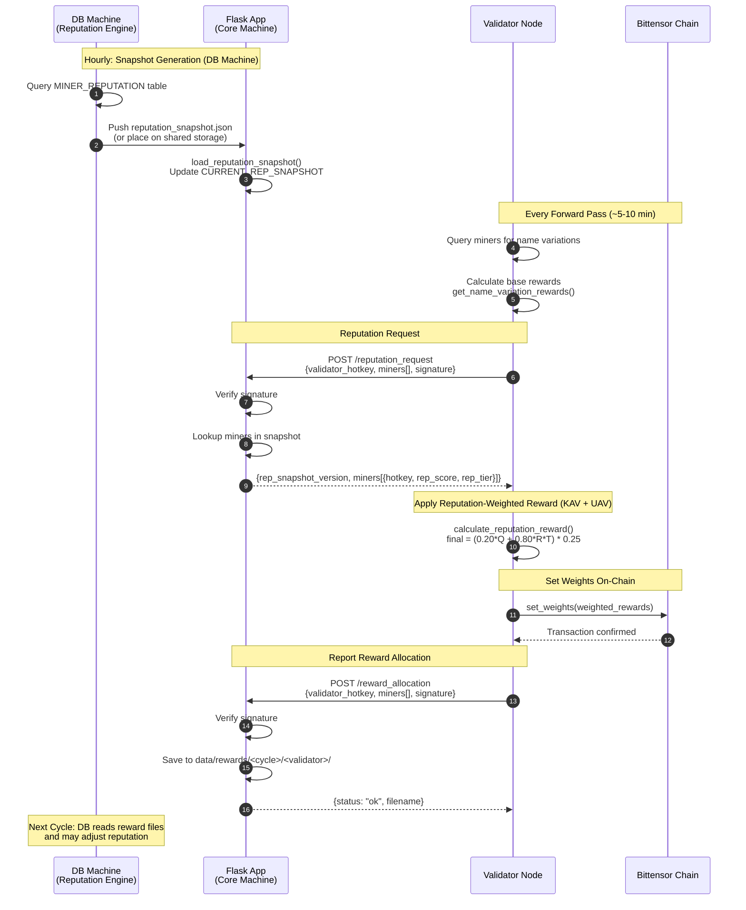

# YANEZ MIID — Reputation-Weighted Reward System (Phase 3)

This document describes the **big-picture architecture**, **data flows**, **math**, and **step-by-step implementation tasks** required to integrate the new **Reputation-Weighted Reward System** between Validators and the Flask App (Core Machine).

It includes:
- High-level system overview (full diagram logic in text)
- Reputation snapshot lifecycle
- Reward allocation lifecycle
- Math used for combining reputation with validator online quality scores
- Fully structured task list you can paste into your code agent
- API schemas and code-level expectations

---

# 1. BIG PICTURE OVERVIEW

Phase 3 of the YANEZ MIID subnet introduces **Reputation-Based Rewards**. That means:

### Validators still compute online quality scores (Phase-2 logic)
### But now they request **Reputation Scores** from the Flask API
### Validators apply multipliers based on `rep_score` and `rep_tier`
### Reputation-weighted rewards are used to compute the actual Bittensor chain weights (on-chain TAO impact)
### Validators submit final weighted rewards back to Flask every hour
### Flask stores them (JSON for now) - later inserted into DB every hour
### Reputation for each cycle is computed based on **manual validation** of UAVs

---

# 2. HIGH-LEVEL DATA FLOW

Below is the conceptual flow extracted from the system diagram.

## **A. Manual Validation -> DB -> Reputation Engine** (Happens on DB machine, not this repo)
1. Human reviewers validate UAVs.
2. Records updated in DB: `validation_score`, `comment`, `status=reviewed`.
3. Reputation Engine Job periodically:
   - Selects `validation_status='reviewed' AND rep_processed_at IS NULL`
   - Computes delta-rep per miner
   - Writes rows into `MINER_REPUTATION_HISTORY`
   - Updates `MINER_REPUTATION`
   - Marks UAVs as processed
4. A reputation snapshot is generated and placed on Flask machine.

## **B. Reputation Snapshot -> Flask -> Validators** (This repo)

### V1 Implementation (File-Based Mock):
1. `data/reputation_snapshot.json` is a file-based mock snapshot on the Flask (core) machine.
2. Generated by a local script following the actual ER diagram structure (`MINER`, `MINER_REPUTATION`).
3. Flask loads this file at startup into `CURRENT_REP_SNAPSHOT` (in-memory dict).

### Snapshot Structure:
```json
{
  "version": "2025-11-20T13:00:00Z",
  "generated_at": "2025-11-20T13:00:00Z",
  "miners": {
    "5CnkkjPdfsA...": { "rep_score": 1.23, "rep_tier": "Bronze" },
    "5DUB7kNLvvx...": { "rep_score": 1.0, "rep_tier": "Neutral" }
  }
}
```

### Validator Flow:
1. Validator calls `POST /reputation_request` with list of miner hotkeys.
2. Flask returns rep data + snapshot version.
3. If Flask is unreachable, validator uses last cached snapshot (never falls back to Neutral).

## **C. Validator Computes Final Rewards -> Sends Back `/reward_allocation`**
1. Validator computes online quality scores Q (Phase-2 logic in `reward.py`).
2. Calculates blended reward using `calculate_blended_reward(Q, R, tier)`:
   - KAV portion: 20% × Q (online quality)
   - UAV portion: 80% × R × T (reputation-based)
   - Apply 75% burn after blending
3. Uses weighted rewards for on-chain weight setting.
4. Sends final JSON to Flask via `POST /reward_allocation`.
5. Flask stores JSON under `data/rewards/`.
6. Cycle repeats every hour.

---

## **D. Sequence Diagram**



---

## **E. Hourly Timing Diagram**

```
Hour    :00        :15        :30        :45        :00
        |----------|----------|----------|----------|

DB Machine:
        [====Snapshot Gen====]
        ^                    ^
        |                    |
        Query DB             Push to Flask

Flask App:
                   [Load]
                   ^
                   |
                   Reload snapshot into memory

Validators (continuous):
        [--forward--][--forward--][--forward--][--forward--]
             |            |            |            |
             v            v            v            v
        fetch rep    fetch rep    fetch rep    fetch rep
        set weights  set weights  set weights  set weights
        send alloc   send alloc   send alloc   send alloc
```

**Timeline Example (One Hour):**
```
:00:00  DB: Start generating new snapshot from MINER_REPUTATION
:00:30  DB: Snapshot complete, push to Flask server
:01:00  Flask: Detect new snapshot, reload into memory
:05:00  Validator A: forward() -> fetch rep (v1) -> weight -> set_weights -> send allocation
:10:00  Validator B: forward() -> fetch rep (v1) -> weight -> set_weights -> send allocation
:15:00  Validator A: forward() -> fetch rep (v1) -> weight -> set_weights -> send allocation
  ...
:55:00  Validator A: forward() -> fetch rep (v1) -> weight -> set_weights -> send allocation
:00:00  DB: Start generating new snapshot (v2)... cycle repeats
```

---

## **F. Scheduler Behavior**

### Snapshot Generation (DB Machine - Not This Repo)
| Aspect | Behavior |
|--------|----------|
| **Frequency** | Hourly (configurable via cron) |
| **Trigger** | Cron job or manual script execution |
| **Output** | `reputation_snapshot.json` placed on Flask machine |
| **V1 Workaround** | Manual script `generate_mock_snapshot.py` creates test data |

### Flask Snapshot Loading
| Aspect | Behavior |
|--------|----------|
| **On Startup** | `load_reputation_snapshot()` called automatically |
| **Hot Reload** | Not implemented in V1 - requires Flask restart or manual call |
| **V2 Enhancement** | Add file watcher or `/reload_snapshot` admin endpoint |

### Validator Forward Loop
| Aspect | Behavior |
|--------|----------|
| **Frequency** | Every forward pass (~5-10 minutes depending on config) |
| **Rep Fetch** | Once per forward pass, for all miners being evaluated |
| **Caching** | Validator caches last successful response; reuses if Flask unavailable |
| **Weight Setting** | Immediately after reputation weighting, before upload |
| **Allocation Send** | After weights are set on chain |

### Reward Allocation Storage (Flask)
| Aspect | Behavior |
|--------|----------|
| **Storage Path** | `data/rewards/<cycle_id>/<validator_hotkey>/reward_<timestamp>.<hex>.json` |
| **Retention** | Indefinite (DB machine reads periodically for ingestion) |
| **V2 Enhancement** | DB machine reads files and updates `MINER_REPUTATION_HISTORY` with `auto_source='got_rewarded'` |

### V1 vs V2 Scheduler Comparison

| Component | V1 (Current) | V2 (Future) |
|-----------|--------------|-------------|
| Snapshot Source | Manual JSON file | DB query + auto-push |
| Flask Reload | On startup only | File watcher / API trigger |
| Reward Processing | JSON files saved | JSON -> DB ingestion pipeline |
| Rep Decay | Not implemented | `got_rewarded` entries decrease rep |

---

# 3. MATH: REPUTATION-WEIGHTED REWARD FORMULA (Cycle 2)

Phase 3 Cycle 2 introduces a **reputation-weighted reward system** that separates emissions into two components:
- **KAV (Known Attack Vector)**: Online quality from validator evaluation
- **UAV (Unknown Attack Vector)**: Reputation-based rewards from manual validation

## Allocation Weights

```python
KAV_WEIGHT = 0.20      # 20% allocated to online quality (Q)
UAV_WEIGHT = 0.80      # 80% allocated to reputation-based rewards
# BURN_FRACTION uses existing config: self.config.neuron.burn_fraction (default: 0.40, set to 0.75 for Cycle 2)
```

> **Note**: `burn_fraction` is an existing config parameter (`--neuron.burn_fraction`). For Cycle 2, set it to `0.75` when running the validator.

## Variables

| Variable | Description | Source |
|----------|-------------|--------|
| `Q` | Online Quality Score | `get_name_variation_rewards()` in validator |
| `R` | Reputation Score | Flask API (computed by DB: novelty × impact × quality × reputation × penalty) |
| `T` | Tier Multiplier | Flask API (based on rep_tier) |

## Tier Multipliers

```python
TIER_MULTIPLIERS = {
    "Diamond": 1.15,
    "Gold":    1.10,
    "Silver":  1.05,
    "Bronze":  1.02,
    "Neutral": 1.00,
    "Watch":   0.90,
}
```

## Formula Steps

### **Step 1 — Calculate KAV Portion (Online Quality)**
```python
kav_reward = KAV_WEIGHT * Q
# Example: 0.20 * 0.85 = 0.17
```

### **Step 2 — Calculate UAV Portion (Reputation-Based)**
The `rep_score` from Flask already includes the full UAV calculation from the DB machine:
`rep_score = novelty × impact × quality × reputation × penalty`

Apply tier multiplier for additional weighting:
```python
T = TIER_MULTIPLIERS.get(rep_tier, 1.0)
uav_reward = UAV_WEIGHT * R * T
# Example: 0.80 * 1.2 * 1.10 = 1.056 (Gold tier, high rep)
```

### **Step 3 — Combine KAV + UAV**
```python
combined_reward = kav_reward + uav_reward
# Example: 0.17 + 1.056 = 1.226
```

### **Step 4 — Apply Burn**
```python
final_reward = combined_reward * (1 - BURN_FRACTION)
# Example: 1.226 * 0.25 = 0.3065
```

### **Step 5 — Metrics for Logging**
```python
kav_contribution = kav_reward / combined_reward  # % from online quality
uav_contribution = uav_reward / combined_reward  # % from reputation
reputation_bonus = final_reward - (Q * (1 - BURN_FRACTION))  # Gain/loss from reputation
```

## Complete Formula (Summary)

```python
def calculate_reputation_reward(Q, rep_score, rep_tier, burn_fraction):
    """
    Q: Online quality score from get_name_variation_rewards()
    rep_score: Reputation score from Flask (DB-computed)
    rep_tier: Tier string from Flask (Diamond/Gold/Silver/Bronze/Neutral/Watch)
    burn_fraction: From self.config.neuron.burn_fraction (default 0.40, use 0.75 for Cycle 2)
    """
    KAV_WEIGHT = 0.20
    UAV_WEIGHT = 0.80

    # Tier multiplier
    T = TIER_MULTIPLIERS.get(rep_tier, 1.0)

    # KAV portion (online quality)
    kav_reward = KAV_WEIGHT * Q

    # UAV portion (reputation-based)
    uav_reward = UAV_WEIGHT * rep_score * T

    # Combine KAV + UAV
    combined_reward = kav_reward + uav_reward

    # Apply burn (uses existing config parameter)
    final_reward = combined_reward * (1 - burn_fraction)

    return {
        "kav_reward": kav_reward,
        "uav_reward": uav_reward,
        "combined_reward": combined_reward,
        "final_reward": final_reward,
        "burn_amount": combined_reward * burn_fraction
    }
```

## Example Calculations

| Miner | Q (Quality) | R (Rep Score) | Tier | KAV (20%) | UAV (80%) | Combined | After Burn (25%) |
|-------|-------------|---------------|------|-----------|-----------|---------|------------------|
| A | 0.90 | 1.40 | Diamond | 0.18 | 1.288 | 1.468 | 0.367 |
| B | 0.85 | 1.00 | Neutral | 0.17 | 0.80 | 0.97 | 0.243 |
| C | 0.70 | 0.80 | Watch | 0.14 | 0.576 | 0.716 | 0.179 |
| D | 0.95 | 0.50 | Watch | 0.19 | 0.36 | 0.55 | 0.138 |

**Key Insight**: Miner D has excellent online quality (0.95) but low reputation (0.50) - they still earn less than Miner B with lower quality but neutral reputation. This incentivizes consistent, long-term good behavior over short-term gaming.

---

# 4. API SCHEMAS

## **4.1 `POST /reputation_request` (Validator -> Flask)**

**Request:**
```json
{
  "validator_hotkey": "5DUB7kNLvvx8Dj7D8tn54N1C7Xok6GodNPQE2WECCaL9Wgpr",
  "miners": ["5CnkkjPdfsA...", "5DUB7kNLvvx..."],
  "signature": "<Bytes>On 2025-11-20 CST ...</Bytes>\n\tSigned by: ...\n\tSignature: ..."
}
```

**Response (Success 200):**
```json
{
  "rep_snapshot_version": "2025-11-20T13:00:00Z",
  "generated_at": "2025-11-20T13:00:00Z",
  "miners": [
    {"miner_hotkey": "5CnkkjPdfsA...", "rep_score": 1.23, "rep_tier": "Bronze"},
    {"miner_hotkey": "5DUB7kNLvvx...", "rep_score": 1.0, "rep_tier": "Neutral"}
  ]
}
```

**Error Responses:**
- `400`: Missing signature or invalid JSON
- `403`: Unauthorized hotkey

---

## **4.2 `POST /reward_allocation` (Validator -> Flask)**

**Request:**
```json
{
  "validator_hotkey": "5DUB7kNLvvx8Dj7D8tn54N1C7Xok6GodNPQE2WECCaL9Wgpr",
  "rep_snapshot_version": "2025-11-20T13:00:00Z",
  "cycle_id": "C1",
  "step_id": "block_12345",
  "timestamp": "2025-11-20T14:00:00Z",
  "miners": [
    {
      "miner_hotkey": "5CnkkjPdfsA...",
      "uid": 42,
      "quality_score": 0.85,
      "rep_score": 1.23,
      "rep_tier": "Bronze",
      "kav_reward": 0.17,
      "uav_reward": 1.00,
      "combined_reward": 1.17,
      "burn_amount": 0.88,
      "final_reward": 0.29,
      "reputation_bonus": 0.08
    }
  ],
  "signature": "<Bytes>On 2025-11-20 CST ...</Bytes>\n\tSigned by: ...\n\tSignature: ..."
}
```

**Response (Success 200):**
```json
{
  "status": "ok",
  "filename": "reward_2025-11-20_14-00-00.a1b2c3d4.json"
}
```

---

# 5. FAILURE HANDLING

## Flask Unavailable
- Validators **keep using the last known snapshot** they fetched.
- Validators **do not fall back to Neutral** - this would unfairly penalize miners.
- Validators cache snapshot locally with `rep_snapshot_version`.

## Snapshot File Missing at Startup
- Flask logs a warning but continues running.
- `/reputation_request` returns all miners as `{rep_score: 1.0, rep_tier: "Neutral"}`.
- Once snapshot file is created/updated, Flask auto-loads it.

## Miner Not in Snapshot
- Return default: `{rep_score: 1.0, rep_tier: "Neutral"}`.

---

# 6. IMPLEMENTATION TASKS

## Overview of Files to Modify/Create

| File | Action |
|------|--------|
| `MIID/datasets/config.py` | Add reputation config (paths, tier multipliers) |
| `MIID/datasets/app.py` | Add `/reputation_request` and `/reward_allocation` endpoints |
| `MIID/validator/reward.py` | Add `calculate_reputation_reward()` function |
| `MIID/utils/misc.py` | Add `fetch_reputation()` and `send_reward_allocation()` helpers |
| `MIID/validator/forward.py` | Integrate reputation into reward loop |
| `scripts/generate_mock_snapshot.py` | New script to generate test snapshots |
| `data/reputation_snapshot.json` | Mock snapshot file (on Flask server) |

---

## **TASK 1 — Add Configuration for Reputation System**

**File:** `MIID/datasets/config.py`

Add:
```python
# Reputation system configuration
REPUTATION_SNAPSHOT_PATH = "/data/MIID_data/reputation_snapshot.json"
REWARDS_DIR = "/data/MIID_data/rewards"

# Reputation-weighted reward allocation (Cycle 2)
KAV_WEIGHT = 0.20      # 20% allocated to online quality (Q)
UAV_WEIGHT = 0.80      # 80% allocated to reputation-based rewards
# Note: burn_fraction already exists as --neuron.burn_fraction (default 0.40)
# For Cycle 2, run validator with: --neuron.burn_fraction 0.75

# Tier multipliers for reputation weighting
TIER_MULTIPLIERS = {
    "Diamond": 1.15,
    "Gold":    1.10,
    "Silver":  1.05,
    "Bronze":  1.02,
    "Neutral": 1.00,
    "Watch":   0.90,
}
```

---

## **TASK 2 — Create Reputation Snapshot Loader and In-Memory Cache**

**File:** `MIID/datasets/app.py`

Add at top (after imports):
```python
import threading

# Global reputation snapshot cache
CURRENT_REP_SNAPSHOT = {
    "version": None,
    "generated_at": None,
    "miners": {}
}
_snapshot_lock = threading.Lock()


def load_reputation_snapshot():
    """Load reputation snapshot from JSON file into memory."""
    global CURRENT_REP_SNAPSHOT

    snapshot_path = REPUTATION_SNAPSHOT_PATH
    if not os.path.exists(snapshot_path):
        bt.logging.warning(f"Reputation snapshot not found at {snapshot_path}. Using empty snapshot.")
        return

    try:
        with open(snapshot_path, 'r', encoding='utf-8') as f:
            data = json.load(f)

        with _snapshot_lock:
            CURRENT_REP_SNAPSHOT = {
                "version": data.get("version"),
                "generated_at": data.get("generated_at"),
                "miners": data.get("miners", {})
            }
        bt.logging.info(f"Loaded reputation snapshot version: {CURRENT_REP_SNAPSHOT['version']} with {len(CURRENT_REP_SNAPSHOT['miners'])} miners")
    except Exception as e:
        bt.logging.error(f"Failed to load reputation snapshot: {e}")


# Load snapshot on module import (Flask startup)
load_reputation_snapshot()
```

---

## **TASK 3 — Implement `/reputation_request` Endpoint**

**File:** `MIID/datasets/app.py`

Add endpoint:
```python
@app.route('/reputation_request', methods=['POST'])
def reputation_request():
    """
    Return reputation scores for requested miners.
    Validators call this to get rep_score and rep_tier for reward weighting.
    """
    # 1) Validate JSON
    if not request.is_json:
        return jsonify({"error": "Request body must be JSON"}), 400

    data = request.get_json()

    # 2) Extract fields
    validator_hotkey = data.get("validator_hotkey")
    miner_hotkeys = data.get("miners", [])
    signature_text = data.get("signature")

    if not validator_hotkey or not signature_text:
        return jsonify({"error": "Missing validator_hotkey or signature"}), 400

    # 3) Check hotkey whitelist
    if validator_hotkey not in ALLOWED_HOTKEYS:
        return jsonify({"error": "Unauthorized hotkey"}), 403

    # 4) Verify signature
    tmp_signature_filename = os.path.join(DATA_DIR, f"tmp_sig_rep_{time.time()}.txt")
    try:
        with open(tmp_signature_filename, 'w', encoding='utf-8') as tmp_file:
            tmp_file.write(signature_text)
        verify_message(tmp_signature_filename)
    except ValueError as e:
        if os.path.exists(tmp_signature_filename):
            os.remove(tmp_signature_filename)
        return jsonify({"error": f"Signature verification failed: {str(e)}"}), 400
    finally:
        if os.path.exists(tmp_signature_filename):
            os.remove(tmp_signature_filename)

    # 5) Build response with reputation data
    with _snapshot_lock:
        snapshot_version = CURRENT_REP_SNAPSHOT.get("version")
        generated_at = CURRENT_REP_SNAPSHOT.get("generated_at")
        miners_data = CURRENT_REP_SNAPSHOT.get("miners", {})

    results = []
    for hk in miner_hotkeys:
        if hk in miners_data:
            entry = miners_data[hk]
            results.append({
                "miner_hotkey": hk,
                "rep_score": entry.get("rep_score", 1.0),
                "rep_tier": entry.get("rep_tier", "Neutral")
            })
        else:
            # Default for unknown miners
            results.append({
                "miner_hotkey": hk,
                "rep_score": 1.0,
                "rep_tier": "Neutral"
            })

    return jsonify({
        "rep_snapshot_version": snapshot_version,
        "generated_at": generated_at,
        "miners": results
    }), 200
```

---

## **TASK 4 — Implement `/reward_allocation` Endpoint**

**File:** `MIID/datasets/app.py`

Add endpoint:
```python
@app.route('/reward_allocation', methods=['POST'])
def reward_allocation():
    """
    Receive and store reward allocation data from validators.
    Saves to JSON file for later DB ingestion.
    """
    # 1) Validate JSON
    if not request.is_json:
        return jsonify({"error": "Request body must be JSON"}), 400

    data = request.get_json()

    # 2) Extract fields
    validator_hotkey = data.get("validator_hotkey")
    signature_text = data.get("signature")
    cycle_id = data.get("cycle_id", "unknown")

    if not validator_hotkey or not signature_text:
        return jsonify({"error": "Missing validator_hotkey or signature"}), 400

    # 3) Check hotkey whitelist
    if validator_hotkey not in ALLOWED_HOTKEYS:
        return jsonify({"error": "Unauthorized hotkey"}), 403

    # 4) Verify signature
    tmp_signature_filename = os.path.join(DATA_DIR, f"tmp_sig_reward_{time.time()}.txt")
    try:
        with open(tmp_signature_filename, 'w', encoding='utf-8') as tmp_file:
            tmp_file.write(signature_text)
        verify_message(tmp_signature_filename)
    except ValueError as e:
        if os.path.exists(tmp_signature_filename):
            os.remove(tmp_signature_filename)
        return jsonify({"error": f"Signature verification failed: {str(e)}"}), 400
    finally:
        if os.path.exists(tmp_signature_filename):
            os.remove(tmp_signature_filename)

    # 5) Create directory structure: data/rewards/<cycle_id>/<validator_hotkey>/
    rewards_dir = os.path.join(REWARDS_DIR, cycle_id, validator_hotkey)
    os.makedirs(rewards_dir, exist_ok=True)

    # 6) Save with unique filename
    timestamp = datetime.now().strftime("%Y-%m-%d_%H-%M-%S")
    random_hex = secrets.token_hex(4)
    filename = f"reward_{timestamp}.{random_hex}.json"
    filepath = os.path.join(rewards_dir, filename)

    with open(filepath, 'w', encoding='utf-8') as f:
        json.dump(data, f, indent=2)

    return jsonify({
        "status": "ok",
        "filename": filename
    }), 200
```

---

## **TASK 5 — Add Reputation Reward Function**

**File:** `MIID/validator/reward.py`

Add at the end of the file (or in a logical location near other reward functions):
```python
# Reputation-weighted reward allocation (Cycle 2)
KAV_WEIGHT = 0.20      # 20% allocated to online quality (Q)
UAV_WEIGHT = 0.80      # 80% allocated to reputation-based rewards
# Note: burn_fraction comes from self.config.neuron.burn_fraction (set to 0.75 for Cycle 2)

# Reputation tier multipliers
TIER_MULTIPLIERS = {
    "Diamond": 1.15,
    "Gold":    1.10,
    "Silver":  1.05,
    "Bronze":  1.02,
    "Neutral": 1.00,
    "Watch":   0.90,
}


def calculate_reputation_reward(Q: float, rep_score: float, rep_tier: str, burn_fraction: float) -> dict:
    """
    Calculate reputation-weighted reward using KAV (online quality) + UAV (reputation-based).

    Cycle 2 Formula:
        kav_reward = KAV_WEIGHT * Q
        uav_reward = UAV_WEIGHT * R * T
        combined = kav_reward + uav_reward
        final = combined * (1 - burn_fraction)

    Args:
        Q: Online quality score from get_name_variation_rewards()
        rep_score: Reputation score (R) from Flask (DB-computed: novelty × impact × quality × reputation × penalty)
        rep_tier: Tier string from Flask (Diamond/Gold/Silver/Bronze/Neutral/Watch)
        burn_fraction: From self.config.neuron.burn_fraction (default 0.40, use 0.75 for Cycle 2)

    Returns:
        dict with:
            - kav_reward: KAV portion (20% of Q)
            - uav_reward: UAV portion (80% of R × T)
            - combined_reward: kav + uav before burn
            - final_reward: after burn applied
            - burn_amount: amount burned
            - tier_multiplier: T value used
            - kav_contribution: % of combined from KAV
            - uav_contribution: % of combined from UAV
            - reputation_bonus: gain/loss compared to no-reputation baseline
    """
    # Tier multiplier
    T = TIER_MULTIPLIERS.get(rep_tier, 1.0)

    # KAV portion (online quality)
    kav_reward = KAV_WEIGHT * Q

    # UAV portion (reputation-based)
    uav_reward = UAV_WEIGHT * rep_score * T

    # Combine KAV + UAV
    combined_reward = kav_reward + uav_reward

    # Apply burn (uses existing config parameter)
    final_reward = combined_reward * (1 - burn_fraction)
    burn_amount = combined_reward * burn_fraction

    # Calculate contributions (avoid division by zero)
    kav_contribution = kav_reward / combined_reward if combined_reward > 0 else 0
    uav_contribution = uav_reward / combined_reward if combined_reward > 0 else 0

    # Calculate reputation bonus (compared to no-reputation baseline)
    baseline_reward = Q * (1 - burn_fraction)
    reputation_bonus = final_reward - baseline_reward

    return {
        "kav_reward": kav_reward,
        "uav_reward": uav_reward,
        "combined_reward": combined_reward,
        "final_reward": final_reward,
        "burn_amount": burn_amount,
        "tier_multiplier": T,
        "kav_contribution": kav_contribution,
        "uav_contribution": uav_contribution,
        "reputation_bonus": reputation_bonus
    }
```

---

## **TASK 6 — Add Flask Client Helpers**

**File:** `MIID/utils/misc.py`

Add after the existing `upload_data` function:
```python
def fetch_reputation(endpoint_base: str, validator_hotkey: str, miner_hotkeys: list, signature: str) -> dict:
    """
    Fetch reputation data from Flask server.

    Args:
        endpoint_base: Base URL (e.g., "http://52.44.186.20:5000")
        validator_hotkey: The validator's hotkey
        miner_hotkeys: List of miner hotkeys to query
        signature: Signed message for authentication

    Returns:
        dict with rep_snapshot_version, generated_at, and miners list
        Returns None if request fails
    """
    # Extract hotkey address if it's a Keypair object
    if hasattr(validator_hotkey, 'ss58_address'):
        validator_hotkey = validator_hotkey.ss58_address

    full_url = f"{endpoint_base.rstrip('/')}/reputation_request"

    payload = {
        "validator_hotkey": validator_hotkey,
        "miners": miner_hotkeys,
        "signature": signature
    }

    try:
        response = requests.post(full_url, json=payload, timeout=30)
        if response.status_code == 200:
            bt.logging.info(f"Successfully fetched reputation for {len(miner_hotkeys)} miners")
            return response.json()
        else:
            bt.logging.error(f"Failed to fetch reputation. Status: {response.status_code}, Response: {response.text}")
            return None
    except Exception as e:
        bt.logging.error(f"Exception fetching reputation: {e}")
        return None


def send_reward_allocation(endpoint_base: str, payload: dict) -> bool:
    """
    Send reward allocation data to Flask server.

    Args:
        endpoint_base: Base URL (e.g., "http://52.44.186.20:5000")
        payload: The reward allocation payload (must include signature)

    Returns:
        True if successful, False otherwise
    """
    full_url = f"{endpoint_base.rstrip('/')}/reward_allocation"

    try:
        response = requests.post(full_url, json=payload, timeout=30)
        if response.status_code == 200:
            bt.logging.info(f"Successfully sent reward allocation")
            return True
        else:
            bt.logging.error(f"Failed to send reward allocation. Status: {response.status_code}")
            return False
    except Exception as e:
        bt.logging.error(f"Exception sending reward allocation: {e}")
        return False
```

---

## **TASK 7 — Integrate Reputation into Validator Loop**

**File:** `MIID/validator/forward.py`

### Step 7.1: Add imports at top
```python
from MIID.utils.misc import fetch_reputation, send_reward_allocation
from MIID.validator.reward import calculate_reputation_reward
```

### Step 7.2: Add server constant (near existing MIID_SERVER)
```python
MIID_SERVER_BASE = "http://52.44.186.20:5000"  # Base URL without endpoint path
```

### Step 7.3: Add reputation fetching and weighting in `forward()` function

**Insert AFTER rewards are calculated** (after `get_name_variation_rewards()` call) **and BEFORE setting weights on chain**:

```python
# --- REPUTATION WEIGHTING INTEGRATION ---
# 1) Build list of miner hotkeys that received rewards
miner_hotkeys_for_rep = [
    self.metagraph.hotkeys[uid]
    for uid in uids
    if rewards[uid] > 0
]

# 2) Sign a message for authentication
rep_message = f"reputation_request validator={self.wallet.hotkey.ss58_address} timestamp={timestamp}"
rep_signature = sign_message(self.wallet, rep_message, output_file=None)

# 3) Fetch reputation from Flask
rep_response = fetch_reputation(
    endpoint_base=MIID_SERVER_BASE,
    validator_hotkey=self.wallet.hotkey,
    miner_hotkeys=miner_hotkeys_for_rep,
    signature=rep_signature
)

# 4) Build hotkey -> rep data lookup
rep_data = {}
rep_snapshot_version = None
if rep_response:
    rep_snapshot_version = rep_response.get("rep_snapshot_version")
    for m in rep_response.get("miners", []):
        rep_data[m["miner_hotkey"]] = {
            "rep_score": m["rep_score"],
            "rep_tier": m["rep_tier"]
        }

# 5) Apply reputation-weighted reward calculation (KAV + UAV with burn)
burn_fraction = getattr(self.config.neuron, 'burn_fraction', 0.40)  # Use existing config
weighted_rewards = rewards.copy()
reward_allocation_miners = []

for uid in uids:
    hotkey = self.metagraph.hotkeys[uid]
    Q = rewards[uid]  # Online quality score

    # Get reputation (default to Neutral if not found)
    rep = rep_data.get(hotkey, {"rep_score": 1.0, "rep_tier": "Neutral"})

    # Calculate reputation-weighted reward (20% KAV + 80% UAV, then apply burn)
    rep_reward = calculate_reputation_reward(
        Q=Q,
        rep_score=rep["rep_score"],
        rep_tier=rep["rep_tier"],
        burn_fraction=burn_fraction
    )

    weighted_rewards[uid] = rep_reward["final_reward"]

    # Build allocation entry for Flask
    reward_allocation_miners.append({
        "miner_hotkey": hotkey,
        "uid": uid,
        "quality_score": Q,
        "rep_score": rep["rep_score"],
        "rep_tier": rep["rep_tier"],
        "kav_reward": rep_reward["kav_reward"],
        "uav_reward": rep_reward["uav_reward"],
        "combined_reward": rep_reward["combined_reward"],
        "burn_amount": rep_reward["burn_amount"],
        "final_reward": rep_reward["final_reward"],
        "reputation_bonus": rep_reward["reputation_bonus"]
    })

# 6) Use weighted_rewards for chain weight setting (replace `rewards` with `weighted_rewards`)
# ... existing set_weights code uses weighted_rewards ...

# 7) Send reward allocation to Flask
allocation_message = f"reward_allocation validator={self.wallet.hotkey.ss58_address} timestamp={timestamp}"
allocation_signature = sign_message(self.wallet, allocation_message, output_file=None)

allocation_payload = {
    "validator_hotkey": self.wallet.hotkey.ss58_address,
    "rep_snapshot_version": rep_snapshot_version,
    "cycle_id": cycle_id,  # Use existing cycle_id or create one
    "step_id": f"block_{self.block}",
    "timestamp": timestamp,
    "miners": reward_allocation_miners,
    "signature": allocation_signature
}

send_reward_allocation(MIID_SERVER_BASE, allocation_payload)
# --- END REPUTATION WEIGHTING INTEGRATION ---
```

---

## **TASK 8 — Create Mock Snapshot Generator Script**

**File:** `scripts/generate_mock_snapshot.py` (new file)

```python
#!/usr/bin/env python3
"""
Generate a mock reputation snapshot for testing.
Run this on the Flask server to create data/reputation_snapshot.json
"""

import json
import random
from datetime import datetime
from pathlib import Path

# Configuration
OUTPUT_PATH = "/data/MIID_data/reputation_snapshot.json"

# Sample miner hotkeys (replace with real ones or fetch from metagraph)
SAMPLE_MINERS = [
    "5CnkkjPdfsA6jJDHv2U6QuiKiivDuvQpECC13ffdmSDbkgtt",
    "5DUB7kNLvvx8Dj7D8tn54N1C7Xok6GodNPQE2WECCaL9Wgpr",
    "5GWzXSra6cBM337nuUU7YTjZQ6ewT2VakDpMj8Pw2i8v8PVs",
    # Add more miners...
]

# Tier thresholds (rep_score -> tier)
def get_tier(rep_score: float) -> str:
    if rep_score >= 1.4:
        return "Diamond"
    elif rep_score >= 1.2:
        return "Gold"
    elif rep_score >= 1.1:
        return "Silver"
    elif rep_score >= 1.0:
        return "Bronze"
    elif rep_score >= 0.9:
        return "Neutral"
    else:
        return "Watch"


def generate_snapshot(miners: list, output_path: str):
    """Generate a mock reputation snapshot."""
    now = datetime.utcnow().strftime("%Y-%m-%dT%H:%M:%SZ")

    snapshot = {
        "version": now,
        "generated_at": now,
        "miners": {}
    }

    for hotkey in miners:
        # Random rep_score between 0.7 and 1.5
        rep_score = round(random.uniform(0.7, 1.5), 2)
        rep_tier = get_tier(rep_score)

        snapshot["miners"][hotkey] = {
            "rep_score": rep_score,
            "rep_tier": rep_tier
        }

    # Ensure directory exists
    Path(output_path).parent.mkdir(parents=True, exist_ok=True)

    # Write snapshot
    with open(output_path, 'w', encoding='utf-8') as f:
        json.dump(snapshot, f, indent=2)

    print(f"Generated snapshot with {len(miners)} miners at {output_path}")
    print(f"Snapshot version: {now}")


if __name__ == "__main__":
    generate_snapshot(SAMPLE_MINERS, OUTPUT_PATH)
```

---

# 7. TESTING CHECKLIST

## Flask Server Tests
- [ ] Flask starts without snapshot file (logs warning, continues)
- [ ] Flask loads snapshot file on startup
- [ ] `POST /reputation_request` returns correct data for known miners
- [ ] `POST /reputation_request` returns Neutral defaults for unknown miners
- [ ] `POST /reputation_request` rejects invalid signatures
- [ ] `POST /reward_allocation` saves JSON to correct directory
- [ ] `POST /reward_allocation` rejects unauthorized hotkeys

## Validator Tests
- [ ] Validator fetches reputation successfully
- [ ] Validator applies reputation weighting correctly
- [ ] Validator handles Flask being unreachable (uses cached/defaults)
- [ ] Validator sends reward allocation to Flask
- [ ] Weighted rewards are used for on-chain weight setting

## Math Verification (KAV + UAV with 75% Burn)
- [ ] Neutral miner (Q=1.0, R=1.0, tier=Neutral):
      - KAV: 0.20 * 1.0 = 0.20
      - UAV: 0.80 * 1.0 * 1.0 = 0.80
      - Combined: 1.00, Final: 0.25
- [ ] Diamond miner (Q=0.90, R=1.4, tier=Diamond):
      - KAV: 0.20 * 0.90 = 0.18
      - UAV: 0.80 * 1.4 * 1.15 = 1.288
      - Combined: 1.468, Final: 0.367
- [ ] Watch miner (Q=0.70, R=0.8, tier=Watch):
      - KAV: 0.20 * 0.70 = 0.14
      - UAV: 0.80 * 0.8 * 0.90 = 0.576
      - Combined: 0.716, Final: 0.179

---

# 8. DIRECTORY STRUCTURE (After Implementation)

```
MIID-subnet/
├── MIID/
│   ├── datasets/
│   │   ├── app.py              # Flask app with new endpoints
│   │   └── config.py           # Added reputation config
│   ├── validator/
│   │   ├── forward.py          # Integrated reputation weighting
│   │   └── reward.py           # Added apply_reputation_weighting()
│   └── utils/
│       └── misc.py             # Added fetch_reputation(), send_reward_allocation()
├── scripts/
│   └── generate_mock_snapshot.py  # New script
└── docs/
    └── reputation_reward_readme.md  # This file

# On Flask server (DATA_DIR):
/data/MIID_data/
├── reputation_snapshot.json    # Loaded at startup
├── rewards/
│   └── <cycle_id>/
│       └── <validator_hotkey>/
│           └── reward_<timestamp>.<hex>.json
└── <validator_hotkey>/         # Existing upload_data storage
    └── <hotkey>.<timestamp>.<hex>.json
```

---

# 9. SUMMARY

This README provides:
- Big picture explanation of Phase 3 reputation-weighted rewards
- Clear data flow from snapshot to validator to Flask
- Reputation-weighted reward formula (20% KAV + 80% UAV with 75% burn and tier multipliers)
- Exact task breakdown with code aligned to existing codebase patterns
- API schemas for both endpoints
- Failure handling strategy
- Testing checklist

**Implementation order:**
1. Task 1: Config (add KAV_WEIGHT, UAV_WEIGHT, TIER_MULTIPLIERS; use existing `--neuron.burn_fraction`)
2. Task 2: Snapshot loader
3. Task 3: `/reputation_request` endpoint
4. Task 4: `/reward_allocation` endpoint
5. Task 5: `calculate_reputation_reward()` function
6. Task 6: Client helpers in `misc.py`
7. Task 7: Integrate into `forward.py`
8. Task 8: Mock snapshot generator

**Key decisions captured:**
- V1 uses file-based mock snapshots (no DB connectivity yet)
- Validators cache last known snapshot if Flask is unreachable
- Reputation multipliers affect on-chain TAO distribution
- Reputation-weighted reward formula: 20% KAV (online quality) + 80% UAV (reputation-based)
- Uses existing `--neuron.burn_fraction` config (set to 0.75 for Cycle 2)
