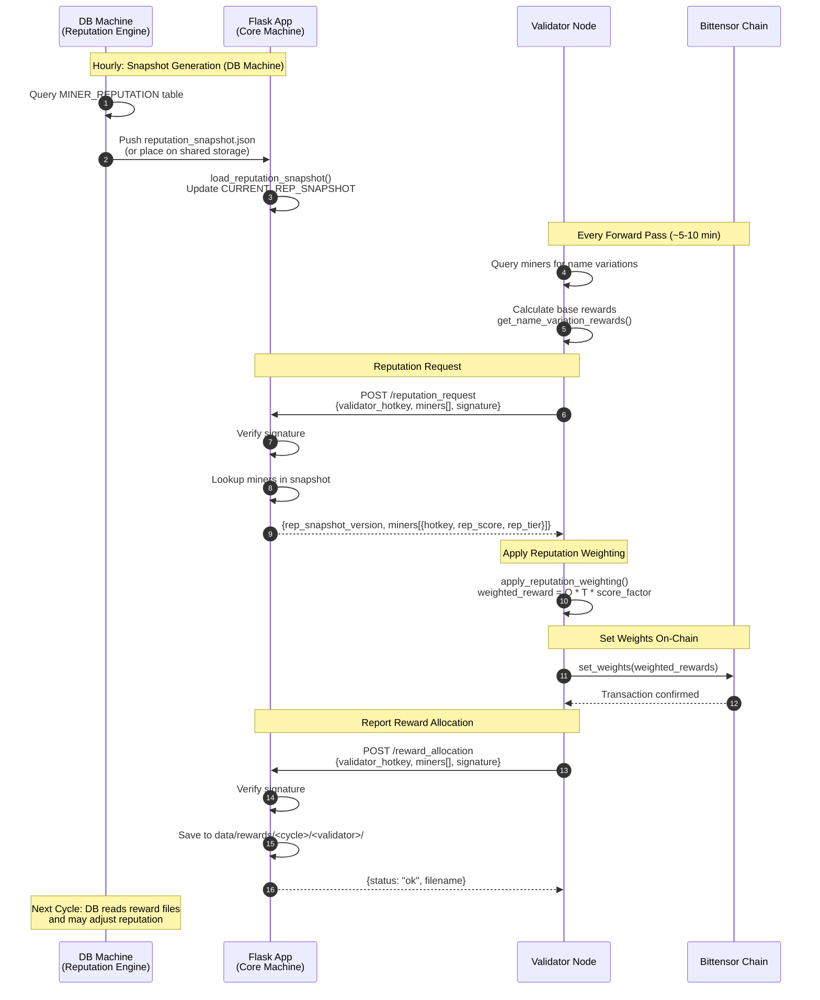

# YANEZ MIID — Reputation-Weighted Reward System (Phase 3)

This document describes the **big-picture architecture**, **data flows**, **math**, and **step-by-step implementation tasks** required to integrate the new **Reputation-Weighted Reward System** between Validators and the Flask App (Core Machine).

It includes:
- High-level system overview (full diagram logic in text)
- Reputation snapshot lifecycle
- Reward allocation lifecycle
- Math used for combining reputation with validator online quality scores
- Fully structured task list you can paste into your code agent
- API schemas and code-level expectations

---

# 1. BIG PICTURE OVERVIEW

Phase 3 of the YANEZ MIID subnet introduces **Reputation-Based Rewards**. That means:

### Validators still compute online quality scores (Phase-2 logic)
### But now they request **Reputation Scores** from the Flask API
### Validators apply multipliers based on `rep_score` and `rep_tier`
### Reputation-weighted rewards are used to compute the actual Bittensor chain weights (on-chain TAO impact)
### Validators submit final weighted rewards back to Flask every hour
### Flask stores them (JSON for now) - later inserted into DB every hour
### Reputation for each cycle is computed based on **manual validation** of UAVs

---

# 2. HIGH-LEVEL DATA FLOW

Below is the conceptual flow extracted from the system diagram.

## **A. Manual Validation -> DB -> Reputation Engine** (Happens on DB machine, not this repo)
1. Human reviewers validate UAVs.
2. Records updated in DB: `validation_score`, `comment`, `status=reviewed`.
3. Reputation Engine Job periodically:
   - Selects `validation_status='reviewed' AND rep_processed_at IS NULL`
   - Computes delta-rep per miner
   - Writes rows into `MINER_REPUTATION_HISTORY`
   - Updates `MINER_REPUTATION`
   - Marks UAVs as processed
4. A reputation snapshot is generated and placed on Flask machine.

## **B. Reputation Snapshot -> Flask -> Validators** (This repo)

### V1 Implementation (File-Based Mock):
1. `data/reputation_snapshot.json` is a file-based mock snapshot on the Flask (core) machine.
2. Generated by a local script following the actual ER diagram structure (`MINER`, `MINER_REPUTATION`).
3. Flask loads this file at startup into `CURRENT_REP_SNAPSHOT` (in-memory dict).

### Snapshot Structure:
```json
{
  "version": "2025-11-20T13:00:00Z",
  "generated_at": "2025-11-20T13:00:00Z",
  "miners": {
    "5CnkkjPdfsA...": { "rep_score": 1.23, "rep_tier": "Bronze" },
    "5DUB7kNLvvx...": { "rep_score": 1.0, "rep_tier": "Neutral" }
  }
}
```

### Validator Flow:
1. Validator calls `POST /reputation_request` with list of miner hotkeys.
2. Flask returns rep data + snapshot version.
3. If Flask is unreachable, validator uses last cached snapshot (never falls back to Neutral).

## **C. Validator Computes Final Rewards -> Sends Back `/reward_allocation`**
1. Validator computes online quality scores (Phase-2 logic in `reward.py`).
2. Applies reputation multipliers using `apply_reputation_weighting()`.
3. Uses weighted rewards for on-chain weight setting.
4. Sends final JSON to Flask via `POST /reward_allocation`.
5. Flask stores JSON under `data/rewards/`.
6. Cycle repeats every hour.

---

## **D. Sequence Diagram**



---

## **E. Hourly Timing Diagram**

```
Hour    :00        :15        :30        :45        :00
        |----------|----------|----------|----------|

DB Machine:
        [====Snapshot Gen====]
        ^                    ^
        |                    |
        Query DB             Push to Flask

Flask App:
                   [Load]
                   ^
                   |
                   Reload snapshot into memory

Validators (continuous):
        [--forward--][--forward--][--forward--][--forward--]
             |            |            |            |
             v            v            v            v
        fetch rep    fetch rep    fetch rep    fetch rep
        set weights  set weights  set weights  set weights
        send alloc   send alloc   send alloc   send alloc
```

**Timeline Example (One Hour):**
```
:00:00  DB: Start generating new snapshot from MINER_REPUTATION
:00:30  DB: Snapshot complete, push to Flask server
:01:00  Flask: Detect new snapshot, reload into memory
:05:00  Validator A: forward() -> fetch rep (v1) -> weight -> set_weights -> send allocation
:10:00  Validator B: forward() -> fetch rep (v1) -> weight -> set_weights -> send allocation
:15:00  Validator A: forward() -> fetch rep (v1) -> weight -> set_weights -> send allocation
  ...
:55:00  Validator A: forward() -> fetch rep (v1) -> weight -> set_weights -> send allocation
:00:00  DB: Start generating new snapshot (v2)... cycle repeats
```

---

## **F. Scheduler Behavior**

### Snapshot Generation (DB Machine - Not This Repo)
| Aspect | Behavior |
|--------|----------|
| **Frequency** | Hourly (configurable via cron) |
| **Trigger** | Cron job or manual script execution |
| **Output** | `reputation_snapshot.json` placed on Flask machine |
| **V1 Workaround** | Manual script `generate_mock_snapshot.py` creates test data |

### Flask Snapshot Loading
| Aspect | Behavior |
|--------|----------|
| **On Startup** | `load_reputation_snapshot()` called automatically |
| **Hot Reload** | Not implemented in V1 - requires Flask restart or manual call |
| **V2 Enhancement** | Add file watcher or `/reload_snapshot` admin endpoint |

### Validator Forward Loop
| Aspect | Behavior |
|--------|----------|
| **Frequency** | Every forward pass (~5-10 minutes depending on config) |
| **Rep Fetch** | Once per forward pass, for all miners being evaluated |
| **Caching** | Validator caches last successful response; reuses if Flask unavailable |
| **Weight Setting** | Immediately after reputation weighting, before upload |
| **Allocation Send** | After weights are set on chain |

### Reward Allocation Storage (Flask)
| Aspect | Behavior |
|--------|----------|
| **Storage Path** | `data/rewards/<cycle_id>/<validator_hotkey>/reward_<timestamp>.<hex>.json` |
| **Retention** | Indefinite (DB machine reads periodically for ingestion) |
| **V2 Enhancement** | DB machine reads files and updates `MINER_REPUTATION_HISTORY` with `auto_source='got_rewarded'` |

### V1 vs V2 Scheduler Comparison

| Component | V1 (Current) | V2 (Future) |
|-----------|--------------|-------------|
| Snapshot Source | Manual JSON file | DB query + auto-push |
| Flask Reload | On startup only | File watcher / API trigger |
| Reward Processing | JSON files saved | JSON -> DB ingestion pipeline |
| Rep Decay | Not implemented | `got_rewarded` entries decrease rep |

---

# 3. MATH: REPUTATION-WEIGHTED REWARD FORMULA

**Variables:**
- `Q` = Online Quality Score (Phase-2) - computed by existing `get_name_variation_rewards()`
- `R` = Reputation Score (baseline 1.0)
- `T` = Tier Multiplier

### **Step 1 — Tier Multiplier**
```python
TIER_MULTIPLIERS = {
    "Diamond": 1.15,
    "Gold":    1.10,
    "Silver":  1.05,
    "Bronze":  1.02,
    "Neutral": 1.00,
    "Watch":   0.90,
}
```

### **Step 2 — Reputation Score Adjustment (Linear Clamp)**
To keep the system stable and predictable, we use a gentle linear clamp:
```python
score_factor = max(0.8, min(rep_score, 1.2))  # clamp between 0.8 and 1.2
```
This gives approximately +/-20% adjustment around Neutral (1.0). Tier multipliers remain the primary lever.

### **Step 3 — Final Reward**
```python
final_reward = Q * T * score_factor
```

### **Step 4 — Reputation Bonus (for logging)**
```python
reputation_bonus = final_reward - Q
```

---

# 4. API SCHEMAS

## **4.1 `POST /reputation_request` (Validator -> Flask)**

**Request:**
```json
{
  "validator_hotkey": "5DUB7kNLvvx8Dj7D8tn54N1C7Xok6GodNPQE2WECCaL9Wgpr",
  "miners": ["5CnkkjPdfsA...", "5DUB7kNLvvx..."],
  "signature": "<Bytes>On 2025-11-20 CST ...</Bytes>\n\tSigned by: ...\n\tSignature: ..."
}
```

**Response (Success 200):**
```json
{
  "rep_snapshot_version": "2025-11-20T13:00:00Z",
  "generated_at": "2025-11-20T13:00:00Z",
  "miners": [
    {"miner_hotkey": "5CnkkjPdfsA...", "rep_score": 1.23, "rep_tier": "Bronze"},
    {"miner_hotkey": "5DUB7kNLvvx...", "rep_score": 1.0, "rep_tier": "Neutral"}
  ]
}
```

**Error Responses:**
- `400`: Missing signature or invalid JSON
- `403`: Unauthorized hotkey

---

## **4.2 `POST /reward_allocation` (Validator -> Flask)**

**Request:**
```json
{
  "validator_hotkey": "5DUB7kNLvvx8Dj7D8tn54N1C7Xok6GodNPQE2WECCaL9Wgpr",
  "rep_snapshot_version": "2025-11-20T13:00:00Z",
  "cycle_id": "C1",
  "step_id": "block_12345",
  "timestamp": "2025-11-20T14:00:00Z",
  "miners": [
    {
      "miner_hotkey": "5CnkkjPdfsA...",
      "base_reward": 0.73,
      "rep_score": 1.23,
      "rep_tier": "Bronze",
      "reputation_bonus": 0.12,
      "total_reward": 0.85
    }
  ],
  "signature": "<Bytes>On 2025-11-20 CST ...</Bytes>\n\tSigned by: ...\n\tSignature: ..."
}
```

**Response (Success 200):**
```json
{
  "status": "ok",
  "filename": "reward_2025-11-20_14-00-00.a1b2c3d4.json"
}
```

---

# 5. FAILURE HANDLING

## Flask Unavailable
- Validators **keep using the last known snapshot** they fetched.
- Validators **do not fall back to Neutral** - this would unfairly penalize miners.
- Validators cache snapshot locally with `rep_snapshot_version`.

## Snapshot File Missing at Startup
- Flask logs a warning but continues running.
- `/reputation_request` returns all miners as `{rep_score: 1.0, rep_tier: "Neutral"}`.
- Once snapshot file is created/updated, Flask auto-loads it.

## Miner Not in Snapshot
- Return default: `{rep_score: 1.0, rep_tier: "Neutral"}`.

---

# 6. IMPLEMENTATION TASKS

## Overview of Files to Modify/Create

| File | Action |
|------|--------|
| `MIID/datasets/config.py` | Add reputation config (paths, tier multipliers) |
| `MIID/datasets/app.py` | Add `/reputation_request` and `/reward_allocation` endpoints |
| `MIID/validator/reward.py` | Add `apply_reputation_weighting()` function |
| `MIID/utils/misc.py` | Add `fetch_reputation()` and `send_reward_allocation()` helpers |
| `MIID/validator/forward.py` | Integrate reputation into reward loop |
| `scripts/generate_mock_snapshot.py` | New script to generate test snapshots |
| `data/reputation_snapshot.json` | Mock snapshot file (on Flask server) |

---

## **TASK 1 — Add Configuration for Reputation System**

**File:** `MIID/datasets/config.py`

Add:
```python
# Reputation system configuration
REPUTATION_SNAPSHOT_PATH = "/data/MIID_data/reputation_snapshot.json"
REWARDS_DIR = "/data/MIID_data/rewards"

# Tier multipliers for reputation weighting
TIER_MULTIPLIERS = {
    "Diamond": 1.15,
    "Gold":    1.10,
    "Silver":  1.05,
    "Bronze":  1.02,
    "Neutral": 1.00,
    "Watch":   0.90,
}

# Score factor clamp range
REP_SCORE_MIN = 0.8
REP_SCORE_MAX = 1.2
```

---

## **TASK 2 — Create Reputation Snapshot Loader and In-Memory Cache**

**File:** `MIID/datasets/app.py`

Add at top (after imports):
```python
import threading

# Global reputation snapshot cache
CURRENT_REP_SNAPSHOT = {
    "version": None,
    "generated_at": None,
    "miners": {}
}
_snapshot_lock = threading.Lock()


def load_reputation_snapshot():
    """Load reputation snapshot from JSON file into memory."""
    global CURRENT_REP_SNAPSHOT

    snapshot_path = REPUTATION_SNAPSHOT_PATH
    if not os.path.exists(snapshot_path):
        bt.logging.warning(f"Reputation snapshot not found at {snapshot_path}. Using empty snapshot.")
        return

    try:
        with open(snapshot_path, 'r', encoding='utf-8') as f:
            data = json.load(f)

        with _snapshot_lock:
            CURRENT_REP_SNAPSHOT = {
                "version": data.get("version"),
                "generated_at": data.get("generated_at"),
                "miners": data.get("miners", {})
            }
        bt.logging.info(f"Loaded reputation snapshot version: {CURRENT_REP_SNAPSHOT['version']} with {len(CURRENT_REP_SNAPSHOT['miners'])} miners")
    except Exception as e:
        bt.logging.error(f"Failed to load reputation snapshot: {e}")


# Load snapshot on module import (Flask startup)
load_reputation_snapshot()
```

---

## **TASK 3 — Implement `/reputation_request` Endpoint**

**File:** `MIID/datasets/app.py`

Add endpoint:
```python
@app.route('/reputation_request', methods=['POST'])
def reputation_request():
    """
    Return reputation scores for requested miners.
    Validators call this to get rep_score and rep_tier for reward weighting.
    """
    # 1) Validate JSON
    if not request.is_json:
        return jsonify({"error": "Request body must be JSON"}), 400

    data = request.get_json()

    # 2) Extract fields
    validator_hotkey = data.get("validator_hotkey")
    miner_hotkeys = data.get("miners", [])
    signature_text = data.get("signature")

    if not validator_hotkey or not signature_text:
        return jsonify({"error": "Missing validator_hotkey or signature"}), 400

    # 3) Check hotkey whitelist
    if validator_hotkey not in ALLOWED_HOTKEYS:
        return jsonify({"error": "Unauthorized hotkey"}), 403

    # 4) Verify signature
    tmp_signature_filename = os.path.join(DATA_DIR, f"tmp_sig_rep_{time.time()}.txt")
    try:
        with open(tmp_signature_filename, 'w', encoding='utf-8') as tmp_file:
            tmp_file.write(signature_text)
        verify_message(tmp_signature_filename)
    except ValueError as e:
        if os.path.exists(tmp_signature_filename):
            os.remove(tmp_signature_filename)
        return jsonify({"error": f"Signature verification failed: {str(e)}"}), 400
    finally:
        if os.path.exists(tmp_signature_filename):
            os.remove(tmp_signature_filename)

    # 5) Build response with reputation data
    with _snapshot_lock:
        snapshot_version = CURRENT_REP_SNAPSHOT.get("version")
        generated_at = CURRENT_REP_SNAPSHOT.get("generated_at")
        miners_data = CURRENT_REP_SNAPSHOT.get("miners", {})

    results = []
    for hk in miner_hotkeys:
        if hk in miners_data:
            entry = miners_data[hk]
            results.append({
                "miner_hotkey": hk,
                "rep_score": entry.get("rep_score", 1.0),
                "rep_tier": entry.get("rep_tier", "Neutral")
            })
        else:
            # Default for unknown miners
            results.append({
                "miner_hotkey": hk,
                "rep_score": 1.0,
                "rep_tier": "Neutral"
            })

    return jsonify({
        "rep_snapshot_version": snapshot_version,
        "generated_at": generated_at,
        "miners": results
    }), 200
```

---

## **TASK 4 — Implement `/reward_allocation` Endpoint**

**File:** `MIID/datasets/app.py`

Add endpoint:
```python
@app.route('/reward_allocation', methods=['POST'])
def reward_allocation():
    """
    Receive and store reward allocation data from validators.
    Saves to JSON file for later DB ingestion.
    """
    # 1) Validate JSON
    if not request.is_json:
        return jsonify({"error": "Request body must be JSON"}), 400

    data = request.get_json()

    # 2) Extract fields
    validator_hotkey = data.get("validator_hotkey")
    signature_text = data.get("signature")
    cycle_id = data.get("cycle_id", "unknown")

    if not validator_hotkey or not signature_text:
        return jsonify({"error": "Missing validator_hotkey or signature"}), 400

    # 3) Check hotkey whitelist
    if validator_hotkey not in ALLOWED_HOTKEYS:
        return jsonify({"error": "Unauthorized hotkey"}), 403

    # 4) Verify signature
    tmp_signature_filename = os.path.join(DATA_DIR, f"tmp_sig_reward_{time.time()}.txt")
    try:
        with open(tmp_signature_filename, 'w', encoding='utf-8') as tmp_file:
            tmp_file.write(signature_text)
        verify_message(tmp_signature_filename)
    except ValueError as e:
        if os.path.exists(tmp_signature_filename):
            os.remove(tmp_signature_filename)
        return jsonify({"error": f"Signature verification failed: {str(e)}"}), 400
    finally:
        if os.path.exists(tmp_signature_filename):
            os.remove(tmp_signature_filename)

    # 5) Create directory structure: data/rewards/<cycle_id>/<validator_hotkey>/
    rewards_dir = os.path.join(REWARDS_DIR, cycle_id, validator_hotkey)
    os.makedirs(rewards_dir, exist_ok=True)

    # 6) Save with unique filename
    timestamp = datetime.now().strftime("%Y-%m-%d_%H-%M-%S")
    random_hex = secrets.token_hex(4)
    filename = f"reward_{timestamp}.{random_hex}.json"
    filepath = os.path.join(rewards_dir, filename)

    with open(filepath, 'w', encoding='utf-8') as f:
        json.dump(data, f, indent=2)

    return jsonify({
        "status": "ok",
        "filename": filename
    }), 200
```

---

## **TASK 5 — Add Reputation Weighting Function**

**File:** `MIID/validator/reward.py`

Add at the end of the file (or in a logical location near other reward functions):
```python
# Reputation tier multipliers
TIER_MULTIPLIERS = {
    "Diamond": 1.15,
    "Gold":    1.10,
    "Silver":  1.05,
    "Bronze":  1.02,
    "Neutral": 1.00,
    "Watch":   0.90,
}

# Score factor clamp range
REP_SCORE_MIN = 0.8
REP_SCORE_MAX = 1.2


def apply_reputation_weighting(base_reward: float, rep_score: float, rep_tier: str) -> dict:
    """
    Apply reputation-based weighting to a base reward.

    Args:
        base_reward: The original quality-based reward (Q)
        rep_score: Miner's reputation score (R), baseline 1.0
        rep_tier: Miner's reputation tier (Diamond, Gold, Silver, Bronze, Neutral, Watch)

    Returns:
        dict with:
            - tier_factor: multiplier from tier
            - score_factor: clamped rep_score
            - final_reward: base_reward * tier_factor * score_factor
            - reputation_bonus: final_reward - base_reward
    """
    # Get tier multiplier (default to Neutral if unknown tier)
    tier_factor = TIER_MULTIPLIERS.get(rep_tier, 1.0)

    # Clamp rep_score to safe range
    score_factor = max(REP_SCORE_MIN, min(rep_score, REP_SCORE_MAX))

    # Calculate final reward
    final_reward = base_reward * tier_factor * score_factor

    # Calculate bonus/penalty from reputation
    reputation_bonus = final_reward - base_reward

    return {
        "tier_factor": tier_factor,
        "score_factor": score_factor,
        "final_reward": final_reward,
        "reputation_bonus": reputation_bonus
    }
```

---

## **TASK 6 — Add Flask Client Helpers**

**File:** `MIID/utils/misc.py`

Add after the existing `upload_data` function:
```python
def fetch_reputation(endpoint_base: str, validator_hotkey: str, miner_hotkeys: list, signature: str) -> dict:
    """
    Fetch reputation data from Flask server.

    Args:
        endpoint_base: Base URL (e.g., "http://52.44.186.20:5000")
        validator_hotkey: The validator's hotkey
        miner_hotkeys: List of miner hotkeys to query
        signature: Signed message for authentication

    Returns:
        dict with rep_snapshot_version, generated_at, and miners list
        Returns None if request fails
    """
    # Extract hotkey address if it's a Keypair object
    if hasattr(validator_hotkey, 'ss58_address'):
        validator_hotkey = validator_hotkey.ss58_address

    full_url = f"{endpoint_base.rstrip('/')}/reputation_request"

    payload = {
        "validator_hotkey": validator_hotkey,
        "miners": miner_hotkeys,
        "signature": signature
    }

    try:
        response = requests.post(full_url, json=payload, timeout=30)
        if response.status_code == 200:
            bt.logging.info(f"Successfully fetched reputation for {len(miner_hotkeys)} miners")
            return response.json()
        else:
            bt.logging.error(f"Failed to fetch reputation. Status: {response.status_code}, Response: {response.text}")
            return None
    except Exception as e:
        bt.logging.error(f"Exception fetching reputation: {e}")
        return None


def send_reward_allocation(endpoint_base: str, payload: dict) -> bool:
    """
    Send reward allocation data to Flask server.

    Args:
        endpoint_base: Base URL (e.g., "http://52.44.186.20:5000")
        payload: The reward allocation payload (must include signature)

    Returns:
        True if successful, False otherwise
    """
    full_url = f"{endpoint_base.rstrip('/')}/reward_allocation"

    try:
        response = requests.post(full_url, json=payload, timeout=30)
        if response.status_code == 200:
            bt.logging.info(f"Successfully sent reward allocation")
            return True
        else:
            bt.logging.error(f"Failed to send reward allocation. Status: {response.status_code}")
            return False
    except Exception as e:
        bt.logging.error(f"Exception sending reward allocation: {e}")
        return False
```

---

## **TASK 7 — Integrate Reputation into Validator Loop**

**File:** `MIID/validator/forward.py`

### Step 7.1: Add imports at top
```python
from MIID.utils.misc import fetch_reputation, send_reward_allocation
from MIID.validator.reward import apply_reputation_weighting
```

### Step 7.2: Add server constant (near existing MIID_SERVER)
```python
MIID_SERVER_BASE = "http://52.44.186.20:5000"  # Base URL without endpoint path
```

### Step 7.3: Add reputation fetching and weighting in `forward()` function

**Insert AFTER rewards are calculated** (after `get_name_variation_rewards()` call) **and BEFORE setting weights on chain**:

```python
# --- REPUTATION WEIGHTING INTEGRATION ---
# 1) Build list of miner hotkeys that received rewards
miner_hotkeys_for_rep = [
    self.metagraph.hotkeys[uid]
    for uid in uids
    if rewards[uid] > 0
]

# 2) Sign a message for authentication
rep_message = f"reputation_request validator={self.wallet.hotkey.ss58_address} timestamp={timestamp}"
rep_signature = sign_message(self.wallet, rep_message, output_file=None)

# 3) Fetch reputation from Flask
rep_response = fetch_reputation(
    endpoint_base=MIID_SERVER_BASE,
    validator_hotkey=self.wallet.hotkey,
    miner_hotkeys=miner_hotkeys_for_rep,
    signature=rep_signature
)

# 4) Build hotkey -> rep data lookup
rep_data = {}
rep_snapshot_version = None
if rep_response:
    rep_snapshot_version = rep_response.get("rep_snapshot_version")
    for m in rep_response.get("miners", []):
        rep_data[m["miner_hotkey"]] = {
            "rep_score": m["rep_score"],
            "rep_tier": m["rep_tier"]
        }

# 5) Apply reputation weighting to rewards
weighted_rewards = rewards.copy()
reward_allocation_miners = []

for uid in uids:
    hotkey = self.metagraph.hotkeys[uid]
    base_reward = rewards[uid]

    # Get reputation (default to Neutral if not found)
    rep = rep_data.get(hotkey, {"rep_score": 1.0, "rep_tier": "Neutral"})

    # Apply weighting
    weighted = apply_reputation_weighting(
        base_reward=base_reward,
        rep_score=rep["rep_score"],
        rep_tier=rep["rep_tier"]
    )

    weighted_rewards[uid] = weighted["final_reward"]

    # Build allocation entry for Flask
    reward_allocation_miners.append({
        "miner_hotkey": hotkey,
        "uid": uid,
        "base_reward": base_reward,
        "rep_score": rep["rep_score"],
        "rep_tier": rep["rep_tier"],
        "reputation_bonus": weighted["reputation_bonus"],
        "total_reward": weighted["final_reward"]
    })

# 6) Use weighted_rewards for chain weight setting (replace `rewards` with `weighted_rewards`)
# ... existing set_weights code uses weighted_rewards ...

# 7) Send reward allocation to Flask
allocation_message = f"reward_allocation validator={self.wallet.hotkey.ss58_address} timestamp={timestamp}"
allocation_signature = sign_message(self.wallet, allocation_message, output_file=None)

allocation_payload = {
    "validator_hotkey": self.wallet.hotkey.ss58_address,
    "rep_snapshot_version": rep_snapshot_version,
    "cycle_id": cycle_id,  # Use existing cycle_id or create one
    "step_id": f"block_{self.block}",
    "timestamp": timestamp,
    "miners": reward_allocation_miners,
    "signature": allocation_signature
}

send_reward_allocation(MIID_SERVER_BASE, allocation_payload)
# --- END REPUTATION WEIGHTING INTEGRATION ---
```

---

## **TASK 8 — Create Mock Snapshot Generator Script**

**File:** `scripts/generate_mock_snapshot.py` (new file)

```python
#!/usr/bin/env python3
"""
Generate a mock reputation snapshot for testing.
Run this on the Flask server to create data/reputation_snapshot.json
"""

import json
import random
from datetime import datetime
from pathlib import Path

# Configuration
OUTPUT_PATH = "/data/MIID_data/reputation_snapshot.json"

# Sample miner hotkeys (replace with real ones or fetch from metagraph)
SAMPLE_MINERS = [
    "5CnkkjPdfsA6jJDHv2U6QuiKiivDuvQpECC13ffdmSDbkgtt",
    "5DUB7kNLvvx8Dj7D8tn54N1C7Xok6GodNPQE2WECCaL9Wgpr",
    "5GWzXSra6cBM337nuUU7YTjZQ6ewT2VakDpMj8Pw2i8v8PVs",
    # Add more miners...
]

# Tier thresholds (rep_score -> tier)
def get_tier(rep_score: float) -> str:
    if rep_score >= 1.4:
        return "Diamond"
    elif rep_score >= 1.2:
        return "Gold"
    elif rep_score >= 1.1:
        return "Silver"
    elif rep_score >= 1.0:
        return "Bronze"
    elif rep_score >= 0.9:
        return "Neutral"
    else:
        return "Watch"


def generate_snapshot(miners: list, output_path: str):
    """Generate a mock reputation snapshot."""
    now = datetime.utcnow().strftime("%Y-%m-%dT%H:%M:%SZ")

    snapshot = {
        "version": now,
        "generated_at": now,
        "miners": {}
    }

    for hotkey in miners:
        # Random rep_score between 0.7 and 1.5
        rep_score = round(random.uniform(0.7, 1.5), 2)
        rep_tier = get_tier(rep_score)

        snapshot["miners"][hotkey] = {
            "rep_score": rep_score,
            "rep_tier": rep_tier
        }

    # Ensure directory exists
    Path(output_path).parent.mkdir(parents=True, exist_ok=True)

    # Write snapshot
    with open(output_path, 'w', encoding='utf-8') as f:
        json.dump(snapshot, f, indent=2)

    print(f"Generated snapshot with {len(miners)} miners at {output_path}")
    print(f"Snapshot version: {now}")


if __name__ == "__main__":
    generate_snapshot(SAMPLE_MINERS, OUTPUT_PATH)
```

---

# 7. TESTING CHECKLIST

## Flask Server Tests
- [ ] Flask starts without snapshot file (logs warning, continues)
- [ ] Flask loads snapshot file on startup
- [ ] `POST /reputation_request` returns correct data for known miners
- [ ] `POST /reputation_request` returns Neutral defaults for unknown miners
- [ ] `POST /reputation_request` rejects invalid signatures
- [ ] `POST /reward_allocation` saves JSON to correct directory
- [ ] `POST /reward_allocation` rejects unauthorized hotkeys

## Validator Tests
- [ ] Validator fetches reputation successfully
- [ ] Validator applies reputation weighting correctly
- [ ] Validator handles Flask being unreachable (uses cached/defaults)
- [ ] Validator sends reward allocation to Flask
- [ ] Weighted rewards are used for on-chain weight setting

## Math Verification
- [ ] Neutral miner (rep_score=1.0, tier=Neutral): final_reward = base_reward
- [ ] Diamond miner (rep_score=1.2, tier=Diamond): final_reward = base_reward * 1.15 * 1.2
- [ ] Watch miner (rep_score=0.8, tier=Watch): final_reward = base_reward * 0.90 * 0.8

---

# 8. DIRECTORY STRUCTURE (After Implementation)

```
MIID-subnet/
├── MIID/
│   ├── datasets/
│   │   ├── app.py              # Flask app with new endpoints
│   │   └── config.py           # Added reputation config
│   ├── validator/
│   │   ├── forward.py          # Integrated reputation weighting
│   │   └── reward.py           # Added apply_reputation_weighting()
│   └── utils/
│       └── misc.py             # Added fetch_reputation(), send_reward_allocation()
├── scripts/
│   └── generate_mock_snapshot.py  # New script
└── docs/
    └── reputation_reward_readme.md  # This file

# On Flask server (DATA_DIR):
/data/MIID_data/
├── reputation_snapshot.json    # Loaded at startup
├── rewards/
│   └── <cycle_id>/
│       └── <validator_hotkey>/
│           └── reward_<timestamp>.<hex>.json
└── <validator_hotkey>/         # Existing upload_data storage
    └── <hotkey>.<timestamp>.<hex>.json
```

---

# 9. SUMMARY

This README provides:
- Big picture explanation of Phase 3 reputation-weighted rewards
- Clear data flow from snapshot to validator to Flask
- Mathematical formula with tier multipliers and score clamping
- Exact task breakdown with code aligned to existing codebase patterns
- API schemas for both endpoints
- Failure handling strategy
- Testing checklist

**Implementation order:**
1. Task 1: Config
2. Task 2: Snapshot loader
3. Task 3: `/reputation_request` endpoint
4. Task 4: `/reward_allocation` endpoint
5. Task 5: `apply_reputation_weighting()` function
6. Task 6: Client helpers in `misc.py`
7. Task 7: Integrate into `forward.py`
8. Task 8: Mock snapshot generator

**Key decisions captured:**
- V1 uses file-based mock snapshots (no DB connectivity yet)
- Validators cache last known snapshot if Flask is unreachable
- Reputation multipliers affect on-chain TAO distribution
- Linear clamp (0.8-1.2) instead of log10 formula
